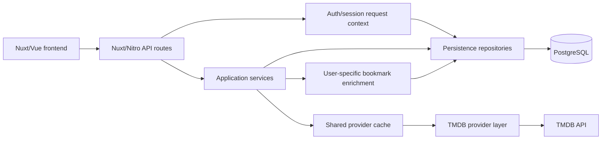
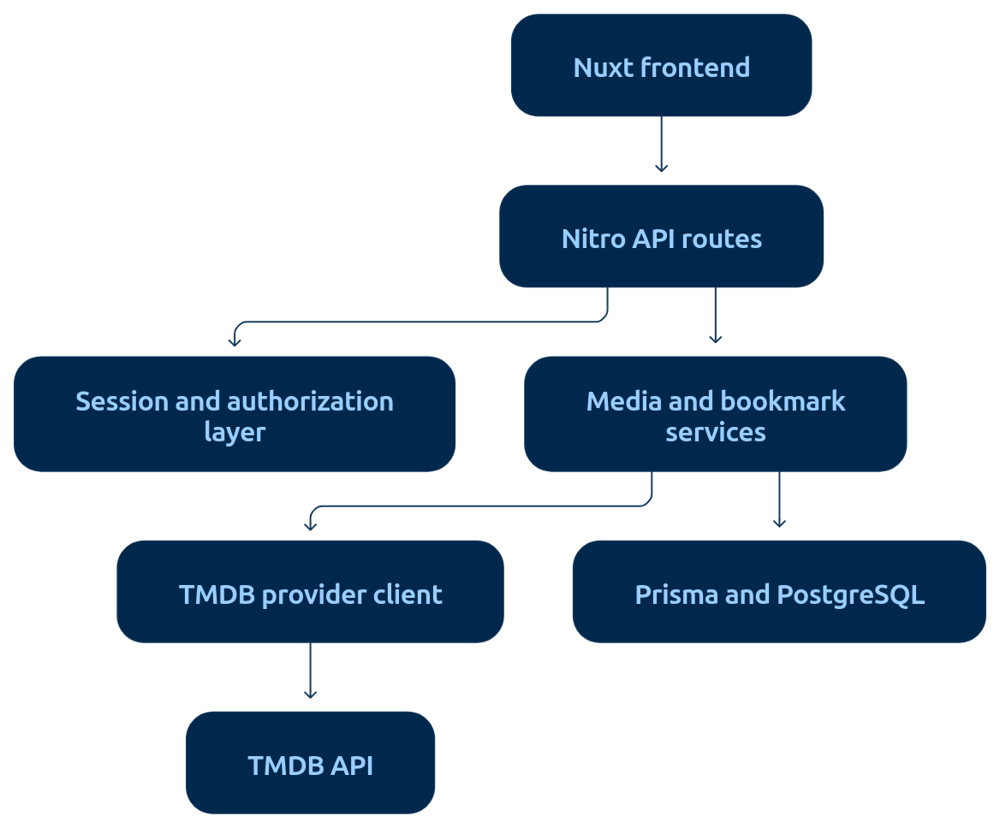
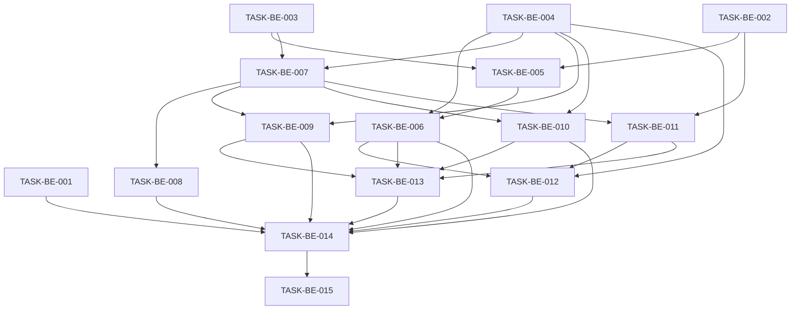
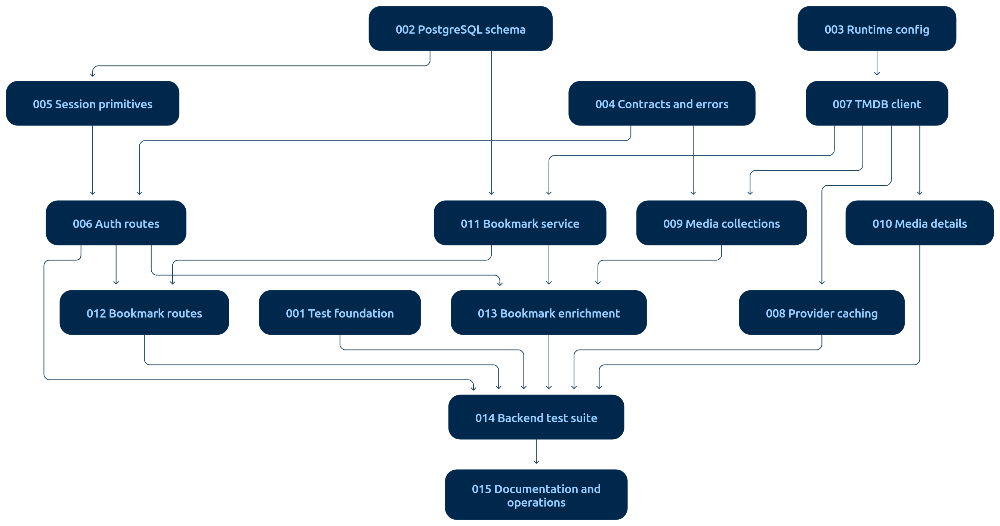

# Backend Implementation Plan

## 1. Executive Summary

This plan evolves the current minimal Nuxt server foundation into the backend defined by **Backend Technical Specification — v1**.

The repository currently contains Prisma models for `User`, `Media`, and `Bookmark`, configured for SQLite, plus a Prisma client singleton. Authentication utilities, sessions, API routes, TMDB integration, backend validation, migrations, seed implementation, and automated tests are absent.

The target architecture uses:

- Nuxt/Nitro as the backend-for-frontend;
- TMDB as the canonical media catalogue;
- PostgreSQL and Prisma for application-owned and user-owned state;
- database-backed opaque sessions;
- lightweight `MediaReference` records for bookmarked TMDB titles;
- normalized media responses that hide TMDB-specific response shapes;
- server-side caching that excludes user-specific bookmark state.

Implementation is divided into foundation, authentication, provider integration, media APIs, bookmark persistence, enrichment, testing, and operational readiness.

The main risks are migration away from the current SQLite schema, TMDB availability and rate limits, rating-region ambiguity, and existing GitHub issues whose scopes reflect the obsolete local-media and JWT architecture.

No core architecture blocker prevents implementation. Six implementation assumptions are recorded and should be confirmed during plan approval.

## 2. Source Baseline

### 2.1 Backend Technical Specification — v1

The following approved decisions control implementation:

- Nuxt/Nitro provides the server API and isolates the frontend from TMDB.
- TMDB is the canonical source for media discovery, search, trending content, and media details.
- The TMDB access token remains server-only.
- PostgreSQL stores accounts, sessions, provider references, bookmarks, and future user-owned state.
- PostgreSQL does not mirror the complete TMDB catalogue.
- Media identity is the tuple `provider + externalId + mediaType`.
- Movies and television series use one normalized `MediaItem` contract.
- `isTrending` is calculated from the current TMDB result context.
- `isBookmarked` is derived from the authenticated user's bookmark records.
- User-specific fields must be added after shared provider caching.
- Authentication uses opaque database-backed sessions rather than self-contained JWT sessions.
- Bookmarks use explicit list, create, and delete operations.
- Lightweight media snapshots allow bookmarked titles to remain renderable when TMDB is temporarily unavailable.
- List and search responses use pagination metadata.
- Full catalogue mirroring, periodic catalogue synchronization, admin synchronization UI, watch history, reviews, and profile management are outside v1.

### 2.2 Current Repository Baseline

Repository evidence is based on the `main` branch snapshot inspected on 2026-09-14.

| Area                          | Current State                              | Evidence                                                                | Required Change                                                                                             |     |     |     |
| ----------------------------- | ------------------------------------------ | ----------------------------------------------------------------------- | ----------------------------------------------------------------------------------------------------------- | --- | --- | --- |
| Nuxt server                   | `EXISTS-PARTIAL`                           | Nuxt 4.2.2 and `server/` exist                                          | Add service, provider, repository, validation, error, middleware, and route layers                          |
| Prisma client                 | `EXISTS-COMPLETE` for the current provider | `server/utils/prisma.ts` provides an HMR-safe singleton                 | Retain the singleton pattern and validate it with PostgreSQL                                                |
| Database provider             | `CONFLICTS-WITH-SPEC`                      | `prisma/schema.prisma` uses `provider = "sqlite"`                       | Replace SQLite with PostgreSQL and create a migration baseline                                              |
| User model                    | `EXISTS-PARTIAL`                           | `User` has `id`, `email`, `password`, timestamps                        | Rename password storage to `passwordHash`; add sessions                                                     |
| Session persistence           | `MISSING`                                  | No `Session` model or session utilities                                 | Add opaque, hashed, expiring database sessions                                                              |
| Media persistence             | `CONFLICTS-WITH-SPEC`                      | `Media` stores a local catalogue, trending flag, rating, and thumbnail  | Replace with lightweight provider-backed `MediaReference`                                                   |
| Bookmark persistence          | `EXISTS-PARTIAL`                           | Join model and uniqueness constraint exist                              | Point bookmarks to `MediaReference` and retain ownership uniqueness                                         |
| Prisma migrations             | `MISSING`                                  | No committed `prisma/migrations/` tree                                  | Create PostgreSQL migration history                                                                         |
| Seed implementation           | `MISSING`                                  | `db:seed` points to absent `prisma/seed.ts`                             | Remove catalogue-seed dependency; add only deterministic development account/reference fixtures if required |
| Authentication packages       | `EXISTS-PARTIAL`                           | `bcrypt`, `jsonwebtoken`, `cookie-es`, and `h3` installed               | Keep bcrypt/cookie support; remove JWT dependency after session migration if unused                         |
| Authentication implementation | `MISSING`                                  | No server auth utilities, middleware, or auth API routes                | Implement session primitives and auth endpoints                                                             |
| Validation                    | `MISSING`                                  | Zod is installed but no schema directories exist                        | Add shared server-side schemas for auth, provider identity, routes, and pagination                          |
| TMDB integration              | `MISSING`                                  | No provider client or runtime configuration                             | Add a server-only TMDB client, normalizers, cache, and failure mapping                                      |
| Media APIs                    | `MISSING`                                  | No `server/api/media/` routes                                           | Add trending, movies, television, search, and details routes                                                |
| Bookmark APIs                 | `MISSING`                                  | No `server/api/bookmarks/` routes                                       | Add authenticated list, create, and delete routes                                                           |
| Configuration                 | `EXISTS-PARTIAL`                           | `.env.example` contains SQLite `DATABASE_URL`, `JWT_SECRET`, `NODE_ENV` | Document PostgreSQL and TMDB settings; retire `JWT_SECRET`                                                  |
| Automated testing             | `MISSING`                                  | `npm test` prints “No tests configured yet” and succeeds                | Install and configure meaningful unit and Nitro/API integration testing                                     |
| CI                            | `EXISTS-PARTIAL`                           | CI runs lint, format, typecheck, no-op tests, and build                 | Make `npm test` execute the backend test suite and add DB test setup                                        |
| Documentation                 | `CONFLICTS-WITH-SPEC`                      | README describes SQLite, JWT, local media, and routes that do not exist | Update only after the implementation matches the target architecture                                        |

### 2.3 Existing Backlog Overlap

The table identifies repository issues likely represented in Project #2. Project membership and fields must be verified again during the GitOps dry run.

| Existing Issue                                   | Current Scope                                 | Planned Relationship        | Notes                                                                                  |     |     |     |
| ------------------------------------------------ | --------------------------------------------- | --------------------------- | -------------------------------------------------------------------------------------- | --- | --- | --- |
| #5 — Setup Database with Prisma                  | SQLite models for User, Media, Bookmark       | `supersede-review-required` | Closed issue documents the old architecture; retain history                            |
| #7 — Implement Validation Schemas                | Client-oriented login/signup validation       | `refine`                    | Expand to authoritative server validation and shared contracts                         |
| #8 — Create Server-Side Authentication Utilities | bcrypt, JWT, cookies, Prisma singleton        | `refine`                    | Prisma singleton exists; JWT scope conflicts with opaque sessions                      |
| #9 — Build Authentication API Endpoints          | Signup, login, logout, global JWT middleware  | `refine`                    | Add `/me`; replace JWT/global protection with session-based route protection           |
| #15 — EPIC 4: Media Management & API             | Local database media and bookmark API         | `supersede-review-required` | Epic assumptions conflict with TMDB-backed discovery                                   |
| #16 — Build Media Retrieval API                  | Local DB listing, filtering, and search       | `refine`                    | Reframe around TMDB routes, normalization, and pagination                              |
| #17 — Build Bookmarks API                        | Read and toggle by local `mediaId`            | `refine`                    | Replace toggle semantics with explicit create/delete and provider identity             |
| #26 — Create Database Seed Script                | Seed 29 local media records                   | `supersede-review-required` | Full local catalogue seed conflicts with the no-mirror decision                        |
| #29 — Manual Testing Checklist                   | Manual auth, search, and bookmark checks      | `partial-overlap`           | Retain UI testing; automated backend coverage is planned separately                    |
| #30 — Performance Optimization                   | Client caching and general optimization       | `partial-overlap`           | Provider response caching needs a focused backend task                                 |
| #32 — Production Configuration                   | SQLite production DB and JWT secret           | `refine`                    | Replace with PostgreSQL, session, and TMDB configuration                               |
| #42 — User Profile Management                    | Profile editing and avatar support            | `unrelated`                 | Deferred beyond backend v1                                                             |
| #43 — Advanced Search & Filters                  | Extended filters and saved preferences        | `partial-overlap`           | Basic TMDB search is v1; advanced filters remain deferred                              |
| #44 — Media Details Page                         | UI plus detailed metadata                     | `partial-overlap`           | Backend media-details contract is v1; page and reviews are separate                    |
| #45 — Integrate External API (TMDB)              | Client, schema IDs, sync, caching, admin sync | `refine`                    | Split into provider client, cache, routes, and normalization; remove mirror/admin sync |
| #46 — Watch History & Continue Watching          | User watch state                              | `unrelated`                 | Explicitly deferred from v1                                                            |

## 3. Requirements Traceability

| Requirement ID | Requirement                                                           | Source                                      | Implemented By                  |     |     |     |
| -------------- | --------------------------------------------------------------------- | ------------------------------------------- | ------------------------------- | --- | --- | --- |
| `ARCH-001`     | Use Nuxt/Nitro as the backend-for-frontend                            | Technical Specification §Architecture       | TASK-BE-004, 006, 009, 010, 012 |
| `ARCH-002`     | Keep TMDB behind the server boundary                                  | Technical Specification §External data      | TASK-BE-003, 007                |
| `ARCH-003`     | Use TMDB as the canonical media catalogue                             | Technical Specification §Data ownership     | TASK-BE-007, 009, 010           |
| `ARCH-004`     | Use PostgreSQL/Prisma for application-owned state                     | Technical Specification §Persistence        | TASK-BE-002                     |
| `ARCH-005`     | Do not mirror the complete TMDB catalogue                             | Technical Specification §Persistence        | TASK-BE-002, 011; `NONGOAL-001` |
| `REQ-001`      | Return normalized media independent of provider response shapes       | Technical Specification §Media contract     | TASK-BE-004, 007                |
| `REQ-002`      | Support trending media                                                | Technical Specification §Media APIs         | TASK-BE-009                     |
| `REQ-003`      | Support movie discovery                                               | Technical Specification §Media APIs         | TASK-BE-009                     |
| `REQ-004`      | Support television discovery                                          | Technical Specification §Media APIs         | TASK-BE-009                     |
| `REQ-005`      | Support multi-type search                                             | Technical Specification §Media APIs         | TASK-BE-009                     |
| `REQ-006`      | Support media details                                                 | Technical Specification §Media APIs         | TASK-BE-010                     |
| `REQ-007`      | Support bookmark list, creation, and deletion                         | Technical Specification §Bookmarks          | TASK-BE-011, 012                |
| `REQ-008`      | Preserve lightweight bookmark snapshots                               | Technical Specification §Persistence        | TASK-BE-002, 011                |
| `REQ-009`      | Return bookmark state with media when user context exists             | Technical Specification §Enrichment         | TASK-BE-013                     |
| `DATA-001`     | Persist unique users by normalized email                              | Technical Specification §User               | TASK-BE-002, 006                |
| `DATA-002`     | Store password hashes only                                            | Technical Specification §User               | TASK-BE-002, 005                |
| `DATA-003`     | Store only hashes of opaque session tokens                            | Technical Specification §Session            | TASK-BE-002, 005                |
| `DATA-004`     | Expire and revoke database sessions                                   | Technical Specification §Session            | TASK-BE-005, 006                |
| `DATA-005`     | Identify media by provider, external ID, and media type               | Technical Specification §MediaReference     | TASK-BE-002, 011                |
| `DATA-006`     | Enforce one bookmark per user/media reference                         | Technical Specification §Bookmark           | TASK-BE-002, 011                |
| `DATA-007`     | Derive trending at runtime rather than persisting it                  | Technical Specification §Derived fields     | TASK-BE-002, 007, 009           |
| `DATA-008`     | Derive bookmark status from user data                                 | Technical Specification §Derived fields     | TASK-BE-011, 013                |
| `API-001`      | Provide signup, login, logout, and current-user routes                | Technical Specification §Auth API           | TASK-BE-006                     |
| `API-002`      | Provide paginated list/search responses                               | Technical Specification §Response contracts | TASK-BE-004, 009, 012           |
| `API-003`      | Validate path, query, and body inputs                                 | Technical Specification §Validation         | TASK-BE-004, 006, 009, 010, 012 |
| `API-004`      | Return stable application errors without provider internals           | Technical Specification §Errors             | TASK-BE-004, 007                |
| `AUTH-001`     | Use opaque database-backed sessions                                   | Technical Specification §Authentication     | TASK-BE-002, 005                |
| `AUTH-002`     | Store the session token in an HttpOnly cookie                         | Technical Specification §Authentication     | TASK-BE-005, 006                |
| `AUTH-003`     | Require authentication and ownership checks for bookmarks             | Technical Specification §Authorization      | TASK-BE-005, 011, 012           |
| `AUTH-004`     | Allow media routes to derive optional authenticated context           | Technical Specification §Enrichment         | TASK-BE-005, 013                |
| `SEC-001`      | Never expose password hashes or session token hashes                  | Technical Specification §Security           | TASK-BE-005, 006, 014           |
| `SEC-002`      | Keep the TMDB credential server-only                                  | Technical Specification §Security           | TASK-BE-003, 007                |
| `SEC-003`      | Use Secure/HttpOnly/SameSite cookie controls                          | Technical Specification §Security           | TASK-BE-005                     |
| `SEC-004`      | Prevent cross-user bookmark access                                    | Technical Specification §Authorization      | TASK-BE-011, 012, 014           |
| `EXT-001`      | Map movie and TV fields into one contract                             | Technical Specification §TMDB mapping       | TASK-BE-007                     |
| `EXT-002`      | Treat certification as content rating, not vote average               | Technical Specification §TMDB mapping       | TASK-BE-010                     |
| `EXT-003`      | Handle provider timeouts, invalid responses, and rate limits          | Technical Specification §Resilience         | TASK-BE-007, 008                |
| `OPS-001`      | Validate required runtime configuration                               | Technical Specification §Configuration      | TASK-BE-003                     |
| `OPS-002`      | Use shared caching only before user enrichment                        | Technical Specification §Caching            | TASK-BE-008, 013                |
| `TEST-001`     | Test services, routes, database behavior, authorization, and failures | Technical Specification §Testing            | TASK-BE-001, 014                |
| `CON-001`      | Preserve the current Nuxt/TypeScript/Prisma stack                     | Technical Specification §Constraints        | All tasks                       |
| `NONGOAL-001`  | No full TMDB mirror or scheduled catalogue sync                       | Technical Specification §Non-goals          | Deferred                        |
| `NONGOAL-002`  | No admin catalogue-management interface                               | Technical Specification §Non-goals          | Deferred                        |
| `NONGOAL-003`  | No watch history, progress tracking, reviews, or ratings              | Technical Specification §Non-goals          | Deferred                        |
| `NONGOAL-004`  | No frontend page implementation in this plan                          | Planner scope                               | Deferred                        |

## 4. Target Backend Architecture



The shared provider cache sits before user-specific bookmark enrichment; cached provider data must remain user-independent.

### Visual reference

The Mermaid diagram above is the canonical, machine-readable architecture definition.  
The following image is included as a human-readable visual reference.



The Nitro route layer validates HTTP input, resolves optional or required user context, invokes services, and translates application errors into HTTP responses. Routes do not call Prisma or TMDB directly.

The provider layer owns authentication to TMDB, request construction, timeouts, response validation, normalization, and provider-error mapping. TMDB-specific payloads do not cross the provider boundary.

The application layer coordinates discovery, details, bookmark enrichment, and media-reference creation. It works with normalized provider results and explicit persistence operations.

PostgreSQL stores:

- `User`;
- `Session`;
- `MediaReference`;
- `Bookmark`.

It does not store trending lists or a complete searchable catalogue.

Shared provider data is cached before user-specific enrichment. Responses containing `isBookmarked` are assembled per request and must not be placed in shared caches.

Authentication uses a random opaque cookie token. Only its cryptographic hash is stored in PostgreSQL. Required-auth routes reject missing, invalid, revoked, and expired sessions. Optional-auth media routes continue anonymously when no valid session exists.

The normalized v1 media contract is:

```ts
type MediaItem = {
  externalId: number
  mediaType: 'MOVIE' | 'TV'
  title: string
  year: number | null
  posterPath: string | null
  backdropPath: string | null
  overview: string | null
  contentRating: string | null
  isTrending: boolean
  isBookmarked: boolean
}
```

Paginated responses use:

```ts
{
  data: MediaItem[]
  meta: {
    page: number
    totalPages: number
    totalResults: number
  }
}
```

## 5. Dependency Graph



### Visual reference

The Mermaid dependency graph above is the canonical, machine-readable task dependency definition.  
The following image is included as a human-readable visual reference.



Parallel implementation opportunities:

- TASK-BE-001, 002, 003, and 004 can begin independently.
- TASK-BE-005 and TASK-BE-007 can run concurrently after their dependencies.
- TASK-BE-008 and TASK-BE-010 can run concurrently after TASK-BE-007.
- TASK-BE-009 and TASK-BE-011 can run concurrently.
- TASK-BE-015 documentation preparation can begin earlier, but final verification depends on TASK-BE-014.

## 6. Implementation Phases

### PHASE-BE-01 — Backend Foundation

**Goal:**

Establish PostgreSQL persistence, runtime configuration, shared contracts, error handling, and real test infrastructure.

**Entry criteria:**

Current `main` branch is available and the technical specification is approved.

**Exit criteria:**

PostgreSQL schema and migration exist; required configuration fails fast when invalid; normalized contracts compile; automated tests run through `npm test`.

**Tasks:**

TASK-BE-001, TASK-BE-002, TASK-BE-003, TASK-BE-004.

**Parallelization:**

All four tasks may proceed concurrently with coordination around `package.json` and shared type locations.

**Risks:**

The SQLite schema has no migration history, and several foundation tasks may touch central configuration files.

### PHASE-BE-02 — Session Authentication

**Goal:**

Provide secure database-backed authentication and authenticated request context.

**Entry criteria:**

TASK-BE-002, TASK-BE-003, and TASK-BE-004 are complete.

**Exit criteria:**

Signup, login, logout, and current-user routes work; sessions are hashed, expiring, revocable, and cookie-backed.

**Tasks:**

TASK-BE-005, TASK-BE-006.

**Parallelization:**

TASK-BE-006 begins after TASK-BE-005 defines the session contract.

**Risks:**

Cookie defaults and deployment HTTPS behavior must be consistent across development and production.

### PHASE-BE-03 — TMDB and Media APIs

**Goal:**

Expose normalized, cached discovery, search, and detail APIs backed by TMDB.

**Entry criteria:**

TASK-BE-003 and TASK-BE-004 are complete.

**Exit criteria:**

All media routes return validated normalized data and stable failures without exposing the TMDB credential or payload format. PHASE-BE-03 is not release-ready for authenticated media consumers until TASK-BE-013 applies user-specific bookmark enrichment.

**Tasks:**

TASK-BE-007, TASK-BE-008, TASK-BE-009, TASK-BE-010.

**Parallelization:**

TASK-BE-008, 009, and 010 may proceed after TASK-BE-007; 009 and 010 can run concurrently.

**Risks:**

TMDB endpoints differ between movies and TV, and certification retrieval requires region-aware mapping.

### PHASE-BE-04 — Bookmark Persistence and Enrichment

**Goal:**

Persist provider-backed bookmarks and enrich media responses with user-specific bookmark state.

**Entry criteria:**

TASK-BE-002, TASK-BE-005, and TASK-BE-007 are complete.

**Exit criteria:**

Authenticated users can list, create, and delete only their own bookmarks; all media endpoints provide correct `isBookmarked` values without per-item database queries.

**Tasks:**

TASK-BE-011, TASK-BE-012, TASK-BE-013.

**Parallelization:**

TASK-BE-011 can be implemented while media routes are being completed. TASK-BE-012 and 013 follow the service contract.

**Risks:**

Concurrent create requests and stale provider snapshots require deterministic upsert behavior.

### PHASE-BE-05 — Verification and Operational Readiness

**Goal:**

Verify the complete backend and align configuration and documentation with deployed behavior.

**Entry criteria:**

All feature tasks are complete.

**Exit criteria:**

Automated success, failure, database, authorization, and provider-mocking tests pass; CI is meaningful; documentation describes the implemented architecture.

**Tasks:**

TASK-BE-014, TASK-BE-015.

**Parallelization:**

Documentation work may overlap with final testing, but documented commands and contracts must be verified after tests pass.

**Risks:**

Production database connectivity and real TMDB credentials cannot be exercised in untrusted CI.

## 7. Detailed Task Specifications

### TASK-BE-001 — Establish backend test infrastructure

**Purpose**

Replace the no-op test command with infrastructure capable of testing services, Nitro routes, PostgreSQL behavior, sessions, and mocked TMDB traffic.

**Source requirements**

- `TEST-001`
- `CON-001`

**Depends on**

- `none`

**Blocks**

- `TASK-BE-014`

**Current state**

`npm test` prints “No tests configured yet” and exits successfully. No test files or test framework are present.

**Implementation scope**

Select and configure a Nuxt-compatible TypeScript test runner, test environment, coverage layout, provider-request mocking, and isolated PostgreSQL test configuration.

**Out of scope**

Complete feature test coverage and browser/UI tests.

**Affected implementation areas**

| Artifact                  | State                         | Purpose                                           |     |     |
| ------------------------- | ----------------------------- | ------------------------------------------------- | --- | --- |
| `package.json`            | Existing / Modify             | Replace the no-op test script                     |
| Test-runner configuration | `PLANNED NEW FILE`            | Configure unit and integration projects           |
| `tests/`                  | `EXPECTED LOCATION`           | Shared setup, fixtures, factories, and smoke test |
| CI workflow               | Existing / Modify if required | Supply the isolated test database                 |

**Technical requirements**

- `npm test` must fail when a test fails.
- Unit tests must run without external network access.
- Integration tests must use an isolated PostgreSQL database.
- TMDB calls must be interceptable without changing production code.
- Tests must reset owned data without targeting development or production databases.
- Test environment secrets must be synthetic.

**API contract**

Not applicable.

**Data / persistence impact**

Defines test database setup and reset behavior; no production schema change.

**External integration impact**

Adds deterministic HTTP mocking for TMDB.

**Acceptance criteria**

- `AC-1` `npm test` executes real tests and returns a nonzero status for a failing test.
- `AC-2` A smoke unit test and database connectivity test pass.
- `AC-3` Test setup rejects a non-test database configuration before destructive cleanup.
- `AC-4` External HTTP calls are disabled unless intercepted.
- `AC-5` CI runs the same test command used locally.

**Testing requirements**

Self-verifying smoke, failure, and database-isolation tests.

**Validation commands**

- `npm run lint`
- `npm run format:check`
- `npm run typecheck`
- `npm test`
- `npm run build`

**Risks / edge cases**

- Native bcrypt behavior may differ across CI platforms.
- Parallel database tests may conflict without unique schemas or serial reset rules.

**GitHub Project recommendation**

- Status: `Backlog`
- Priority: `P0`
- Size: `M`
- Estimate: `3`

**GitOps notes**

Partial overlap with #29. Do not replace its frontend manual checklist automatically.

---

### TASK-BE-002 — Migrate persistence to PostgreSQL and provider-backed models

**Purpose**

Implement the approved ownership model and remove the local catalogue architecture.

**Source requirements**

- `ARCH-004`
- `ARCH-005`
- `DATA-001` through `DATA-008`
- `AUTH-001`

**Depends on**

- `none`

**Blocks**

- `TASK-BE-005`
- `TASK-BE-011`

**Current state**

Prisma uses SQLite and defines `User.password`, a full `Media` catalogue, and bookmarks keyed to local media UUIDs. No migrations are committed.

**Implementation scope**

Switch Prisma to PostgreSQL and define `User`, `Session`, `MediaReference`, and `Bookmark` with indexes, ownership relations, timestamps, expiry fields, and cascade behavior.

**Out of scope**

TMDB synchronization, watch history, reviews, ratings, user profiles, and production migration execution.

**Affected implementation areas**

| Artifact                 | State                               | Purpose                                    |     |     |
| ------------------------ | ----------------------------------- | ------------------------------------------ | --- | --- |
| `prisma/schema.prisma`   | Existing / Modify                   | PostgreSQL provider and v1 models          |
| `prisma/migrations/`     | `PLANNED NEW`                       | Initial PostgreSQL migration               |
| `server/utils/prisma.ts` | Existing / Verify                   | PostgreSQL-compatible client singleton     |
| `prisma/seed.ts`         | `PLANNED NEW FILE` only if retained | Minimal deterministic development fixtures |

**Technical requirements**

- `User.email` is unique and stored in normalized form.
- `User.passwordHash` replaces `password`.
- `Session` contains user relation, unique `tokenHash`, `expiresAt`, creation timestamp, and optional revocation metadata if the implementation uses revocation instead of deletion.
- `MediaReference` contains provider, external ID, media type, title snapshot, year snapshot, poster-path snapshot, and timestamps.
- `MediaReference` has a compound unique constraint on provider, external ID, and media type.
- `Bookmark` belongs to one user and one media reference.
- `Bookmark` has a compound unique constraint on user and media reference.
- Indexes support session-hash lookup, session expiry cleanup, user bookmark listing, and provider identity lookup.
- `isTrending` and `isBookmarked` are not persisted on `MediaReference`.
- Existing uncommitted SQLite development data is treated as disposable unless separately backed up.

**API contract**

Not applicable.

**Data / persistence impact**

Destructive development schema replacement. This is the first committed PostgreSQL migration baseline.

**External integration impact**

None.

**Acceptance criteria**

- `AC-1` Prisma validates with the PostgreSQL provider.
- `AC-2` A clean PostgreSQL database can apply the committed migration.
- `AC-3` Duplicate user emails, media identities, bookmarks, and session hashes are rejected by database constraints.
- `AC-4` Deleting a user removes its sessions and bookmarks.
- `AC-5` Deleting an unreferenced media reference is safe and cannot remove another user's account data.
- `AC-6` No full-catalogue or persisted trending fields remain.
- `AC-7` Prisma Client generation succeeds.

**Testing requirements**

Database constraint, cascade, index-driven lookup, and migration-from-empty tests.

**Validation commands**

- `npx prisma format`
- `npx prisma validate`
- `npm run db:generate`
- `npm test`
- `npm run typecheck`
- `npm run build`

**Risks / edge cases**

- SQLite and PostgreSQL differ in case sensitivity and enum handling.
- Rename versus recreate operations must be reviewed before any non-development migration.

**GitHub Project recommendation**

- Status: `Backlog`
- Priority: `P0`
- Size: `L`
- Estimate: `5`

**GitOps notes**

Closed #5 reflects the obsolete schema. #26 should be reviewed because catalogue seeding conflicts with this task.

---

### TASK-BE-003 — Validate backend runtime configuration

**Purpose**

Define and validate database, session, TMDB, locale, region, timeout, and caching configuration without exposing secrets.

**Source requirements**

- `ARCH-002`
- `OPS-001`
- `SEC-002`

**Depends on**

- `none`

**Blocks**

- `TASK-BE-005`
- `TASK-BE-007`

**Current state**

`.env.example` contains SQLite `DATABASE_URL`, `JWT_SECRET`, and `NODE_ENV`. `nuxt.config.ts` has no runtime configuration for the backend.

**Implementation scope**

Add server-only runtime configuration, startup validation, safe defaults for nonsecret options, and an updated example environment file.

**Out of scope**

Real credentials, deployment-platform provisioning, and provider calls.

**Affected implementation areas**

| Artifact                 | State                                        | Purpose                                    |     |     |
| ------------------------ | -------------------------------------------- | ------------------------------------------ | --- | --- |
| `.env.example`           | Existing / Modify                            | Document required variables without values |
| `nuxt.config.ts`         | Existing / Modify                            | Register private runtime configuration     |
| Backend config validator | `PLANNED NEW FILE`, expected under `server/` | Fail fast on invalid configuration         |

**Technical requirements**

- `DATABASE_URL` must be a PostgreSQL connection URL.
- `TMDB_ACCESS_TOKEN` must be private runtime configuration.
- Locale, certification region, request timeout, and cache TTL settings must have validated bounds.
- Server logs and validation errors must never print secret values.
- `JWT_SECRET` is removed after no runtime code uses it.
- Client-exposed `public` runtime configuration must not contain the TMDB token.

**API contract**

Not applicable.

**Data / persistence impact**

Changes the expected `DATABASE_URL` provider.

**External integration impact**

Defines TMDB request configuration.

**Acceptance criteria**

- `AC-1` Startup fails with an actionable error when a required variable is missing.
- `AC-2` Invalid numeric, locale, or region configuration is rejected.
- `AC-3` The TMDB token cannot be obtained through public runtime config or serialized Nuxt payloads.
- `AC-4` `.env.example` contains placeholders and explanations without usable secrets.
- `AC-5` No production environment file containing credentials is committed.

**Testing requirements**

Configuration parsing tests for valid, missing, malformed, and secret-redaction cases.

**Validation commands**

- `npm run lint`
- `npm run typecheck`
- `npm test`
- `npm run build`

**Risks / edge cases**

- Deployment systems may inject database URLs with provider-specific query parameters.
- Cache values of zero must have explicit disabled semantics.

**GitHub Project recommendation**

- Status: `Backlog`
- Priority: `P0`
- Size: `S`
- Estimate: `2`

**GitOps notes**

Refine #32. Its SQLite and JWT examples must not be reused unchanged.

---

### TASK-BE-004 — Define normalized contracts, validation, and application errors

**Purpose**

Create one authoritative boundary contract for media, pagination, provider identity, authentication input, and safe API errors.

**Source requirements**

- `REQ-001`
- `API-002`
- `API-003`
- `API-004`

**Depends on**

- `none`

**Blocks**

- `TASK-BE-006`
- `TASK-BE-009`
- `TASK-BE-010`
- `TASK-BE-012`

**Current state**

Zod is installed, but no repository validation schemas or backend error conventions exist.

**Implementation scope**

Define `MediaItem`, media type/provider values, pagination metadata, auth schemas, provider-identity schemas, and typed application errors translated consistently by Nitro.

**Out of scope**

Route handlers, provider requests, and UI form behavior.

**Affected implementation areas**

| Artifact                       | State               | Purpose                                |     |     |
| ------------------------------ | ------------------- | -------------------------------------- | --- | --- |
| Shared/server contract modules | `PLANNED NEW FILES` | Media and pagination contracts         |
| Validation modules             | `PLANNED NEW FILES` | Auth, query, path, and body validation |
| Error utility/handler          | `PLANNED NEW FILE`  | Stable HTTP-safe errors                |

**Technical requirements**

- Media type accepts only `MOVIE` or `TV`.
- External IDs are positive integers.
- Page values are positive integers with a documented upper bound.
- Search text is trimmed, length-bounded, and rejects empty queries.
- Email is trimmed and normalized before persistence.
- Invalid input returns HTTP 400 with stable code, message, and optional field errors.
- Authentication failures return 401; ownership/permission failures return 403 only when resource disclosure is safe; missing resources return 404; conflicts return 409.
- Provider failures use application codes and do not expose upstream response bodies or tokens.
- Database constraint details and stack traces are not returned.

**API contract**

All v1 routes use JSON and the common validation/error rules established here.

**Data / persistence impact**

None.

**External integration impact**

Defines the output boundary used by TMDB normalization.

**Acceptance criteria**

- `AC-1` One exported schema validates every `MediaItem`.
- `AC-2` Pagination metadata has one shared schema and type.
- `AC-3` Invalid path, query, and body examples produce deterministic 400 responses.
- `AC-4` Provider and database errors can be mapped without leaking implementation details.
- `AC-5` Route code can consume inferred TypeScript types without duplicate interfaces.

**Testing requirements**

Unit tests for accepted/rejected values and error-to-HTTP mapping.

**Validation commands**

- `npm run lint`
- `npm run format:check`
- `npm run typecheck`
- `npm test`
- `npm run build`

**Risks / edge cases**

- Shared modules must not import server-only secrets or Prisma clients.
- TMDB may omit optional fields, which must normalize to `null`.

**GitHub Project recommendation**

- Status: `Backlog`
- Priority: `P0`
- Size: `M`
- Estimate: `3`

**GitOps notes**

Refine #7. Preserve useful password rules while making server validation authoritative.

---

### TASK-BE-005 — Implement opaque session and authentication primitives

**Purpose**

Provide password hashing, session creation, cookie handling, session lookup, optional authentication, required authentication, revocation, and expiry cleanup.

**Source requirements**

- `AUTH-001`
- `AUTH-002`
- `AUTH-003`
- `AUTH-004`
- `DATA-003`
- `DATA-004`
- `SEC-001`
- `SEC-003`

**Depends on**

- `TASK-BE-002`
- `TASK-BE-003`

**Blocks**

- `TASK-BE-006`
- `TASK-BE-012`
- `TASK-BE-013`

**Current state**

bcrypt, jsonwebtoken, cookie-es, and h3 are installed. Only the Prisma singleton exists; there are no auth utilities or middleware.

**Implementation scope**

Implement password hashing/comparison, cryptographically secure opaque tokens, token hashing, session persistence, cookie helpers, authenticated-user resolution, and session revocation.

**Out of scope**

Auth page UI, OAuth, password recovery, email verification, roles, and authorization beyond resource ownership.

**Affected implementation areas**

| Artifact                    | State                               | Purpose                               |     |     |
| --------------------------- | ----------------------------------- | ------------------------------------- | --- | --- |
| `server/utils/prisma.ts`    | Existing / Reuse                    | Database access                       |
| Auth/session utilities      | `PLANNED NEW FILES` under `server/` | Hashing, cookies, session lifecycle   |
| Auth request-context helper | `PLANNED NEW FILE`                  | Optional and required user resolution |

**Technical requirements**

- Session tokens use a cryptographically secure random generator.
- Only a one-way token hash is persisted.
- Raw tokens appear only in the cookie and current request memory.
- Cookie is `HttpOnly`, `SameSite=Lax`, `Path=/`, and `Secure` in production.
- Cookie expiry and database `expiresAt` agree.
- Invalid or expired sessions behave as unauthenticated and may clear the stale cookie.
- Required-auth helpers return 401.
- Optional-auth helpers return no user without failing anonymous media requests.
- Password hash work factor is at least the repository's existing minimum of 10.
- Passwords, hashes, raw tokens, and token hashes are excluded from logs and DTOs.
- JWT utilities are not introduced; `jsonwebtoken` is removable after migration.

**API contract**

Internal authentication contract used by routes.

**Data / persistence impact**

Reads and writes `User` and `Session`; session creation should be atomic with any session-limit enforcement.

**External integration impact**

None.

**Acceptance criteria**

- `AC-1` A raw session token authenticates only when its hash matches an unexpired database record.
- `AC-2` Database inspection cannot reveal a usable session token.
- `AC-3` Logout/revocation prevents subsequent authentication with the same cookie.
- `AC-4` Optional authentication does not reject anonymous media requests.
- `AC-5` Required authentication rejects missing, malformed, expired, and revoked sessions.
- `AC-6` Cookie attributes match the required environment.
- `AC-7` No sensitive auth value appears in serialized responses.

**Testing requirements**

Unit and DB integration tests covering token generation, hashing, expiry, revocation, cookie attributes, and optional/required auth.

**Validation commands**

- `npm run lint`
- `npm run typecheck`
- `npm test`
- `npm run build`

**Risks / edge cases**

- Concurrent logout and authenticated requests.
- Clock boundary around expiry.
- Cookie clearing must use matching path and security attributes.

**GitHub Project recommendation**

- Status: `Backlog`
- Priority: `P0`
- Size: `L`
- Estimate: `5`

**GitOps notes**

Refine #8. Mark the JWT portion obsolete while retaining bcrypt/cookie intentions.

---

### TASK-BE-006 — Implement authentication API routes

**Purpose**

Expose signup, login, logout, and current-user behavior through validated Nitro routes.

**Source requirements**

- `API-001`
- `DATA-001`
- `DATA-002`
- `SEC-001`
- `AUTH-001`
- `AUTH-002`

**Depends on**

- `TASK-BE-004`
- `TASK-BE-005`

**Blocks**

- `TASK-BE-012`
- `TASK-BE-013`
- `TASK-BE-014`

**Current state**

No server auth routes exist. Login UI exists, while signup is currently a placeholder.

**Implementation scope**

Create the four auth routes, sanitize user responses, normalize emails, handle duplicate accounts, verify credentials, issue sessions, revoke the current session, and resolve the current user.

**Out of scope**

Frontend integration, password reset, verification email, OAuth, and profile editing.

**Affected implementation areas**

| Artifact                         | State              | Purpose                        |     |     |
| -------------------------------- | ------------------ | ------------------------------ | --- | --- |
| `server/api/auth/signup.post.ts` | `PLANNED NEW FILE` | Register and authenticate      |
| `server/api/auth/login.post.ts`  | `PLANNED NEW FILE` | Authenticate and issue session |
| `server/api/auth/logout.post.ts` | `PLANNED NEW FILE` | Revoke current session         |
| `server/api/auth/me.get.ts`      | `PLANNED NEW FILE` | Return current sanitized user  |
| Auth validation/contracts        | Planned / Reuse    | Validate request and response  |

**Technical requirements**

- Signup hashes the password before persistence.
- Duplicate normalized email returns 409 without revealing stored account details beyond the conflict.
- Login returns one generic invalid-credentials response for unknown email and wrong password.
- Successful signup and login set the session cookie.
- Logout is idempotent and clears the cookie.
- `/me` requires a valid session.
- Responses expose only approved account fields.
- Route handlers delegate session and database behavior to services/utilities.

**API contract**

| Method | Route                                | Authentication           | Input                                  | Success                             | Errors        |     |     |     |     |     |
| ------ | ------------------------------------ | ------------------------ | -------------------------------------- | ----------------------------------- | ------------- | --- | --- | --- | --- | --- |
| POST   | `PROPOSED ENDPOINT /api/auth/signup` | Anonymous                | email, password, password confirmation | 201, sanitized user, session cookie | 400, 409, 500 |
| POST   | `PROPOSED ENDPOINT /api/auth/login`  | Anonymous                | email, password                        | 200, sanitized user, session cookie | 400, 401, 500 |
| POST   | `PROPOSED ENDPOINT /api/auth/logout` | Optional current session | None                                   | 204, cleared cookie                 | 500           |
| GET    | `PROPOSED ENDPOINT /api/auth/me`     | Required                 | None                                   | 200, sanitized user                 | 401, 500      |

**Data / persistence impact**

Creates users and sessions; reads users; deletes or revokes sessions.

**External integration impact**

None.

**Acceptance criteria**

- `AC-1` Valid signup creates one user with a password hash and one session.
- `AC-2` Duplicate normalized emails return 409 without creating another account.
- `AC-3` Valid login creates a session; invalid credentials return the same 401 shape.
- `AC-4` Logout invalidates the current session and clears the cookie.
- `AC-5` `/me` returns the current sanitized account and rejects invalid sessions.
- `AC-6` Password and session fields never appear in route responses.

**Testing requirements**

Route/API, database, cookie, validation, duplicate-email, invalid-credentials, logout, and unauthorized tests.

**Validation commands**

- `npm run lint`
- `npm run typecheck`
- `npm test`
- `npm run build`

**Risks / edge cases**

- Concurrent signup requests for the same normalized email.
- Password timing behavior should not materially reveal whether an account exists.

**GitHub Project recommendation**

- Status: `Backlog`
- Priority: `P0`
- Size: `L`
- Estimate: `5`

**GitOps notes**

Refine #9. Replace JWT middleware and add `/me`; do not globally protect media routes.

---

### TASK-BE-007 — Build the TMDB client and normalization layer

**Purpose**

Create the sole integration boundary to TMDB and normalize movie and TV payloads into the approved contract.

**Source requirements**

- `ARCH-002`
- `ARCH-003`
- `REQ-001`
- `EXT-001`
- `EXT-003`
- `SEC-002`

**Depends on**

- `TASK-BE-003`
- `TASK-BE-004`

**Blocks**

- `TASK-BE-008`
- `TASK-BE-009`
- `TASK-BE-010`
- `TASK-BE-011`

**Current state**

No TMDB configuration, client, provider interfaces, DTO validation, or normalization exists.

**Implementation scope**

Implement authenticated requests, timeouts, expected-response validation, provider errors, pagination mapping, movie/TV normalization, and request mocking seams.

**Out of scope**

Nitro media routes, bookmark persistence, full catalogue import, scheduled synchronization, and user enrichment.

**Affected implementation areas**

| Artifact             | State                                                       | Purpose                                                               |     |     |
| -------------------- | ----------------------------------------------------------- | --------------------------------------------------------------------- | --- | --- |
| TMDB client          | `PLANNED NEW FILE`, expected under `server/providers/tmdb/` | Perform server-only requests                                          |
| Provider DTO schemas | `PLANNED NEW FILE`                                          | Validate upstream payloads                                            |
| Media normalizer     | `PLANNED NEW FILE`                                          | Map movie/TV payloads                                                 |
| Provider error types | `PLANNED NEW FILE`                                          | Classify timeout, rate, auth, not-found, and invalid payload failures |

**Technical requirements**

- Authenticate with the configured TMDB Bearer token.
- Support trending, movie discovery, TV discovery, multi-search, movie details, TV details, and certification/content-rating requests needed by v1.
- Map movie `title` and `release_date` to title/year.
- Map TV `name` and `first_air_date` to title/year.
- Preserve poster and backdrop paths as paths.
- Convert absent optional fields to `null`.
- Search excludes unsupported person results.
- Provider response validation occurs before normalization.
- Provider authentication and invalid-token errors are never returned verbatim to clients.
- Every request has a finite timeout.
- The client exposes a stable interface that can be mocked in tests.

**API contract**

Internal provider contract; no direct public endpoint.

**Data / persistence impact**

None.

**External integration impact**

Introduces all v1 TMDB reads. No provider write or sync operation is allowed.

**Acceptance criteria**

- `AC-1` Movie and TV fixtures normalize to the same `MediaItem` schema.
- `AC-2` Missing dates and images normalize to `null`.
- `AC-3` Multi-search removes person and unsupported media results.
- `AC-4` Provider pagination maps to the approved metadata shape.
- `AC-5` Timeout, 401/403, 404, 429, 5xx, malformed JSON, and invalid payloads produce classified application errors.
- `AC-6` No TMDB token appears in client responses, logs, or thrown public errors.
- `AC-7` Tests make no live TMDB request.

**Testing requirements**

Unit fixture tests, mocked HTTP tests, timeout/rate-limit tests, redaction tests, and schema-regression fixtures.

**Validation commands**

- `npm run lint`
- `npm run typecheck`
- `npm test`
- `npm run build`

**Risks / edge cases**

- TMDB can add new media types to multi-search.
- Date fields may be empty strings rather than absent.
- Provider response changes must fail safely.

**GitHub Project recommendation**

- Status: `Backlog`
- Priority: `P0`
- Size: `L`
- Estimate: `5`

**GitOps notes**

Refine and split #45. Exclude synchronization and admin UI.

---

### TASK-BE-008 — Add provider caching and resilience controls

**Purpose**

Reduce TMDB traffic while keeping cached provider data separate from user-specific state.

**Source requirements**

- `EXT-003`
- `OPS-002`
- `SEC-002`

**Depends on**

- `TASK-BE-007`

**Blocks**

- `TASK-BE-014`

**Current state**

No backend caching or provider resilience exists.

**Implementation scope**

Add cache keys, TTL categories, request coalescing where supported, safe retry behavior, and cache bypass for failures and user enrichment.

**Out of scope**

Distributed cache infrastructure, background warming, catalogue synchronization, and caching authenticated response bodies.

**Affected implementation areas**

| Artifact               | State              | Purpose                             |     |     |
| ---------------------- | ------------------ | ----------------------------------- | --- | --- |
| Provider cache utility | `PLANNED NEW FILE` | Cache normalized provider responses |
| TMDB client/service    | Planned / Modify   | Apply cache and resilience          |
| Runtime config         | Planned / Modify   | TTL and timeout settings            |

**Technical requirements**

- Cache keys include operation, media type, page, query, locale, and region where applicable.
- Provider configuration metadata may use a long-lived TTL.
- Trending and discovery use short or medium configurable TTLs.
- Search caching is query-sensitive and bounded.
- 4xx/5xx errors and invalid payloads are not cached.
- Shared cache entries contain no `userId`, session, or `isBookmarked=true` state.
- Retry only safe idempotent reads and honor rate-limit behavior.
- Concurrent identical misses should not create uncontrolled duplicate requests.

**API contract**

No API shape change.

**Data / persistence impact**

None unless the selected Nitro cache backend requires deployment configuration; PostgreSQL is not used as a TMDB response cache in v1.

**External integration impact**

Reduces duplicate TMDB reads and handles transient provider failures.

**Acceptance criteria**

- `AC-1` Repeated identical requests within TTL produce one provider call.
- `AC-2` Cache keys differ for page, query, locale, region, and media type.
- `AC-3` Provider failures are never returned from cache as successful data.
- `AC-4` Cached data contains no user-specific bookmark state.
- `AC-5` TTL expiry results in a new provider request.
- `AC-6` Retry behavior is bounded and testable.

**Testing requirements**

Cache hit/miss, key separation, expiry, concurrent request, failure, and retry tests with fake time.

**Validation commands**

- `npm run lint`
- `npm run typecheck`
- `npm test`
- `npm run build`

**Risks / edge cases**

- Serverless instances may have independent in-memory caches.
- Retrying 429 responses without delay can worsen throttling.

**GitHub Project recommendation**

- Status: `Backlog`
- Priority: `P1`
- Size: `M`
- Estimate: `3`

**GitOps notes**

Partial overlap with #30 and #45. Keep this task backend/provider-specific.

---

### TASK-BE-009 — Implement media discovery and search routes

**Purpose**

Expose trending, movies, TV, and search through normalized paginated Nitro endpoints.

**Source requirements**

- `REQ-002`
- `REQ-003`
- `REQ-004`
- `REQ-005`
- `API-002`
- `API-003`
- `ARCH-001`

**Depends on**

- `TASK-BE-004`
- `TASK-BE-007`

**Blocks**

- `TASK-BE-013`
- `TASK-BE-014`

**Current state**

No media routes exist. Existing issue #16 assumes local database queries.

**Implementation scope**

Implement four thin route handlers and a media service that validates requests, invokes TMDB, assigns runtime trending state, and returns pagination.

**Out of scope**

Bookmark lookup, details, advanced filters, arbitrary sorting, and local media queries.

**Affected implementation areas**

| Artifact                           | State                                                 | Purpose                              |     |     |
| ---------------------------------- | ----------------------------------------------------- | ------------------------------------ | --- | --- |
| Media service                      | `PLANNED NEW FILE`, expected under `server/services/` | Coordinate normalized listing/search |
| `server/api/media/trending.get.ts` | `PLANNED NEW FILE`                                    | Trending endpoint                    |
| `server/api/media/movies.get.ts`   | `PLANNED NEW FILE`                                    | Movie discovery                      |
| `server/api/media/tv.get.ts`       | `PLANNED NEW FILE`                                    | TV discovery                         |
| `server/api/media/search.get.ts`   | `PLANNED NEW FILE`                                    | Multi-search                         |

**Technical requirements**

- All routes accept validated `page`.
- Search accepts validated `q`.
- Trending results set `isTrending=true`; other result contexts set it to false unless directly known from that response.
- Before TASK-BE-013, `isBookmarked` may default to false only as a transitional implementation state; these routes are not release-ready for authenticated media consumers until TASK-BE-013 is complete.
- Search retains each result's correct media type.
- Provider errors use TASK-BE-004 mappings.
- Route handlers contain no provider DTO mapping.

**API contract**

| Method | Route                                   | Authentication | Query       | Success                  |     |     |     |     |
| ------ | --------------------------------------- | -------------- | ----------- | ------------------------ | --- | --- | --- | --- |
| GET    | `PROPOSED ENDPOINT /api/media/trending` | Optional       | `page`      | Paginated `MediaItem`    |
| GET    | `PROPOSED ENDPOINT /api/media/movies`   | Optional       | `page`      | Paginated movie items    |
| GET    | `PROPOSED ENDPOINT /api/media/tv`       | Optional       | `page`      | Paginated TV items       |
| GET    | `PROPOSED ENDPOINT /api/media/search`   | Optional       | `q`, `page` | Paginated movie/TV items |

Errors: 400 invalid input, 502 invalid/upstream failure, 503 timeout/unavailable, and 429 when the application intentionally propagates provider throttling semantics.

**Data / persistence impact**

No writes and no catalogue reads from PostgreSQL.

**External integration impact**

Reads corresponding TMDB endpoints through the provider client.

**Acceptance criteria**

- `AC-1` Each route returns the approved normalized pagination shape.
- `AC-2` Movie and TV results expose the correct media type.
- `AC-3` Person results never appear in search.
- `AC-4` Invalid query/page input is rejected before a provider call.
- `AC-5` Trending state reflects response context and is not stored.
- `AC-6` No route imports Prisma or sends TMDB DTOs directly.

**Testing requirements**

Route success, pagination, validation, empty-result, mixed search, and provider-failure tests.

**Validation commands**

- `npm run lint`
- `npm run typecheck`
- `npm test`
- `npm run build`

**Risks / edge cases**

- TMDB can report large total page counts; enforce provider-supported page limits.
- Search query encoding and Unicode normalization.

**GitHub Project recommendation**

- Status: `Backlog`
- Priority: `P0`
- Size: `L`
- Estimate: `5`

**GitOps notes**

Refine #16. The existing category/trending query design should be replaced by explicit provider-backed routes. Do not treat this task as release-ready for authenticated media consumers until TASK-BE-013 is complete.

---

### TASK-BE-010 — Implement media details and content-rating resolution

**Purpose**

Return one normalized movie or TV detail response, including certification-derived content rating.

**Source requirements**

- `REQ-006`
- `EXT-002`
- `API-003`
- `API-004`

**Depends on**

- `TASK-BE-004`
- `TASK-BE-007`

**Blocks**

- `TASK-BE-014`

**Current state**

No details route or content-rating resolution exists.

**Implementation scope**

Validate media type and external ID, fetch the correct detail endpoint, resolve regional certification/content rating, normalize the result, and map missing media to 404.

**Out of scope**

Cast, reviews, user ratings, recommendations, watch providers, and frontend detail pages unless explicitly added to the approved v1 specification.

**Affected implementation areas**

| Artifact              | State                                                  | Purpose                        |     |     |
| --------------------- | ------------------------------------------------------ | ------------------------------ | --- | --- |
| Media detail service  | `PLANNED NEW FILE`                                     | Coordinate details and ratings |
| Dynamic details route | `PLANNED NEW FILE`, expected under `server/api/media/` | Serve movie/TV details         |
| TMDB normalizer       | Planned / Modify                                       | Apply content rating           |

**Technical requirements**

- Path type maps only approved movie and TV identifiers.
- External ID must be a positive integer.
- Movie certification and TV content rating use the configured region.
- Vote average must never populate `contentRating`.
- Missing or unavailable certification produces `null`.
- `isTrending` is false unless the request context explicitly establishes it.
- `isBookmarked` may default to false only as a transitional implementation state; the details route is not release-ready for authenticated media consumers until TASK-BE-013 is complete.
- Missing provider media returns 404; provider outages do not return 404.

**API contract**

- Method: GET
- Route: `PROPOSED ENDPOINT /api/media/:type/:externalId`
- Authentication: optional
- Params: `type = movie | tv`; positive integer `externalId`
- Success: `200 { data: MediaItem }`
- Errors: 400, 404, 502, 503

**Data / persistence impact**

No persistence.

**External integration impact**

Fetches media details and certification/content-rating data.

**Acceptance criteria**

- `AC-1` Movie and TV details validate against `MediaItem`.
- `AC-2` Configured-region certification populates `contentRating`.
- `AC-3` Missing certification returns `null`.
- `AC-4` Vote average is never used as content rating.
- `AC-5` Unsupported type and invalid ID return 400 without provider calls.
- `AC-6` Missing media returns 404 and provider outage returns an upstream failure.

**Testing requirements**

Movie, TV, region selection, no-rating, invalid params, missing media, and provider failure tests.

**Validation commands**

- `npm run lint`
- `npm run typecheck`
- `npm test`
- `npm run build`

**Risks / edge cases**

- Multiple ratings can exist for one region.
- Ratings may be missing, blank, or unordered.

**GitHub Project recommendation**

- Status: `Backlog`
- Priority: `P1`
- Size: `M`
- Estimate: `3`

**GitOps notes**

Partial overlap with #44 and #45. Keep UI, cast, reviews, and recommendations outside this issue. Do not treat this task as release-ready for authenticated media consumers until TASK-BE-013 is complete.

---

### TASK-BE-011 — Implement media-reference and bookmark persistence services

**Purpose**

Create transactional, provider-identity-based persistence independent of HTTP routing.

**Source requirements**

- `REQ-007`
- `REQ-008`
- `DATA-005`
- `DATA-006`
- `DATA-008`
- `AUTH-003`

**Depends on**

- `TASK-BE-002`
- `TASK-BE-007`

**Blocks**

- `TASK-BE-012`
- `TASK-BE-013`

**Current state**

The Prisma schema has a bookmark-to-local-media relation, but no repository or service implementation.

**Implementation scope**

Implement media-reference lookup/upsert, snapshot refresh, bookmark create/delete/list, batch existence lookup, transactions, and ownership filters.

**Out of scope**

HTTP handlers, UI store behavior, catalogue import, bookmark folders, history, and recommendations.

**Affected implementation areas**

| Artifact                   | State              | Purpose                                             |     |     |
| -------------------------- | ------------------ | --------------------------------------------------- | --- | --- |
| Media-reference repository | `PLANNED NEW FILE` | Identity and snapshot persistence                   |
| Bookmark repository        | `PLANNED NEW FILE` | Owned bookmark queries                              |
| Bookmark service           | `PLANNED NEW FILE` | Provider verification and transaction orchestration |

**Technical requirements**

- Bookmark creation accepts provider identity, not a client-generated database UUID.
- Server fetches or verifies media through TMDB before first reference creation.
- Snapshot fields come from normalized provider data rather than arbitrary client fields.
- Media-reference and bookmark creation are transactionally safe.
- Concurrent creation is idempotent through database constraints and conflict recovery.
- Delete filters by authenticated `userId` and provider identity.
- List orders bookmarks deterministically, newest first unless the approved specification states otherwise.
- Batch lookup accepts a collection of provider identities and performs bounded queries without one query per media item.
- Bookmark deletion must not delete a media reference still used by another bookmark.
- Stored snapshots allow listing during a TMDB outage.

**API contract**

Internal service contract.

**Data / persistence impact**

Reads and writes `MediaReference` and `Bookmark`; uses transaction and compound unique constraints.

**External integration impact**

Fetches normalized media for verified snapshot creation or refresh.

**Acceptance criteria**

- `AC-1` First creation persists one reference and one owned bookmark.
- `AC-2` Repeated or concurrent creation produces one bookmark.
- `AC-3` Two users may bookmark the same media reference independently.
- `AC-4` A user cannot delete or list another user's bookmark.
- `AC-5` Bookmark listing succeeds from snapshots when TMDB is unavailable.
- `AC-6` Batch lookup resolves all matching identities with a bounded number of queries.
- `AC-7` Reference cleanup never deletes a reference used by another bookmark.

**Testing requirements**

Database integration, concurrent create, ownership, snapshot, provider failure, delete, and batch-query tests.

**Validation commands**

- `npx prisma validate`
- `npm run db:generate`
- `npm run lint`
- `npm run typecheck`
- `npm test`

**Risks / edge cases**

- Media titles and posters can change upstream.
- Failed provider verification must not leave orphan references.
- Orphan cleanup after deletion must be race-safe or deferred.

**GitHub Project recommendation**

- Status: `Backlog`
- Priority: `P0`
- Size: `L`
- Estimate: `5`

**GitOps notes**

Refines the persistence portion of #17 and the external-ID portion of #45.

---

### TASK-BE-012 — Implement bookmark API routes

**Purpose**

Expose explicit authenticated bookmark operations using provider identity.

**Source requirements**

- `REQ-007`
- `API-002`
- `API-003`
- `AUTH-003`
- `SEC-004`

**Depends on**

- `TASK-BE-004`
- `TASK-BE-006`
- `TASK-BE-011`

**Blocks**

- `TASK-BE-014`

**Current state**

No bookmark routes exist. Issue #17 proposes a toggle endpoint using a local media UUID.

**Implementation scope**

Create authenticated list, create, and delete handlers with pagination, validation, ownership enforcement, and normalized snapshot responses.

**Out of scope**

Toggle semantics, frontend Pinia implementation, folders, watch-later as a separate entity, and history.

**Affected implementation areas**

| Artifact                             | State              | Purpose                          |     |     |
| ------------------------------------ | ------------------ | -------------------------------- | --- | --- |
| `server/api/bookmarks/index.get.ts`  | `PLANNED NEW FILE` | List current user's bookmarks    |
| `server/api/bookmarks/index.post.ts` | `PLANNED NEW FILE` | Create bookmark                  |
| Dynamic bookmark delete route        | `PLANNED NEW FILE` | Delete by media identity         |
| Bookmark validation                  | Planned / Reuse    | Validate identity and pagination |

**Technical requirements**

- Every route requires a valid session.
- List returns only bookmarks owned by the authenticated user.
- Create accepts `externalId` and `mediaType`; provider is fixed to TMDB in v1.
- Create is idempotent from the user's perspective.
- Delete uses authenticated user ownership in the database operation.
- Missing owned bookmark deletion is idempotent with 204 or uses the single approved not-found behavior consistently.
- Snapshot-derived bookmark items use the normalized media contract; unavailable detail fields are `null`.
- `isBookmarked` is true for every listed bookmark.
- `isTrending` is false because bookmark persistence does not establish current trending status.

**API contract**

| Method | Route                                                | Authentication | Input                       | Success                                  |     |     |     |     |
| ------ | ---------------------------------------------------- | -------------- | --------------------------- | ---------------------------------------- | --- | --- | --- | --- |
| GET    | `PROPOSED ENDPOINT /api/bookmarks`                   | Required       | `page`                      | Paginated bookmarked `MediaItem` values  |
| POST   | `PROPOSED ENDPOINT /api/bookmarks`                   | Required       | `{ externalId, mediaType }` | 201 for new or 200 for existing bookmark |
| DELETE | `PROPOSED ENDPOINT /api/bookmarks/:type/:externalId` | Required       | Validated path              | 204                                      |

Errors: 400, 401, 404 for unknown provider media during create, 502/503 for provider validation failure, and 500 for unexpected persistence failure.

**Data / persistence impact**

Creates, reads, and deletes owned bookmarks and may upsert media references.

**External integration impact**

Bookmark creation may fetch TMDB to verify identity and store a snapshot.

**Acceptance criteria**

- `AC-1` Anonymous requests return 401.
- `AC-2` List returns only the authenticated user's records with pagination.
- `AC-3` Create cannot duplicate a bookmark under retries or concurrent requests.
- `AC-4` Delete cannot affect another user's bookmark.
- `AC-5` Invalid media identity is rejected before persistence.
- `AC-6` Bookmark list remains available from snapshots during provider outage.
- `AC-7` Toggle-by-local-UUID behavior is absent.

**Testing requirements**

Route, authorization, ownership, idempotency, pagination, validation, provider failure, and snapshot fallback tests.

**Validation commands**

- `npm run lint`
- `npm run typecheck`
- `npm test`
- `npm run build`

**Risks / edge cases**

- Clients retrying POST after a timeout must receive stable state.
- Dynamic route naming must avoid collision with media routes.

**GitHub Project recommendation**

- Status: `Backlog`
- Priority: `P0`
- Size: `L`
- Estimate: `5`

**GitOps notes**

Refine #17. Its local `mediaId` and toggle semantics conflict with the technical specification.

---

### TASK-BE-013 — Enrich media responses with bookmark state

**Purpose**

Set `isBookmarked` accurately for authenticated users while preserving cache safety and query efficiency.

**Source requirements**

- `REQ-009`
- `DATA-008`
- `AUTH-004`
- `OPS-002`
- `SEC-004`

**Depends on**

- `TASK-BE-006`
- `TASK-BE-009`
- `TASK-BE-010`
- `TASK-BE-011`

**Blocks**

- `TASK-BE-014`

**Current state**

No media routes or enrichment implementation exists. The approved media contract requires `isBookmarked`.

**Implementation scope**

Resolve optional user context, collect provider identities from normalized results, batch-load bookmark matches, and merge state after provider caching.

**Out of scope**

Changing TMDB cache entries, returning bookmark database IDs, frontend state management, and live catalogue synchronization.

**Affected implementation areas**

| Artifact                    | State            | Purpose                       |     |     |
| --------------------------- | ---------------- | ----------------------------- | --- | --- |
| Media service               | Planned / Modify | Invoke enrichment             |
| Bookmark service/repository | Planned / Reuse  | Batch identity lookup         |
| Media routes                | Planned / Modify | Resolve optional user context |
| Provider cache              | Planned / Verify | Remain user-independent       |

**Technical requirements**

- Anonymous responses set every `isBookmarked` to false.
- Authenticated requests set true only for the requesting user's matches.
- List enrichment uses one bounded batch lookup rather than per-item queries.
- Details enrichment uses a direct identity lookup.
- Shared cache entries are read before enrichment and never mutated in place.
- No user identifier appears in shared cache keys or values.
- Expired/invalid optional sessions are handled according to the auth contract without leaking bookmark state.

**API contract**

No route or response-shape change; updates the semantics of the existing `isBookmarked` field.

**Data / persistence impact**

Read-only bookmark queries.

**External integration impact**

None beyond consuming cached/provider results.

**Acceptance criteria**

- `AC-1` Anonymous responses always contain `isBookmarked=false`.
- `AC-2` Two users requesting the same cached provider result receive independent bookmark state.
- `AC-3` List enrichment performs no per-item database query.
- `AC-4` A user's bookmark state is never visible to another user.
- `AC-5` Shared cached objects remain unchanged after enrichment.
- `AC-6` Trending, movies, TV, search, and details all use the same enrichment behavior.

**Testing requirements**

Anonymous, two-user isolation, cache contamination, list query-count, details lookup, and expired-session tests.

**Validation commands**

- `npm run lint`
- `npm run typecheck`
- `npm test`
- `npm run build`

**Risks / edge cases**

- Mutating cached arrays or objects can leak bookmark state.
- Duplicate provider identities should be deduplicated before database lookup.

**GitHub Project recommendation**

- Status: `Backlog`
- Priority: `P1`
- Size: `M`
- Estimate: `3`

**GitOps notes**

Partial overlap across #16 and #17. A separate issue keeps caching and user-data isolation reviewable.

---

### TASK-BE-014 — Complete backend integration, security, and regression coverage

**Purpose**

Verify the complete backend contract across HTTP, database, authentication, TMDB, caching, and cross-user isolation.

**Source requirements**

- `TEST-001`
- `SEC-001`
- `SEC-002`
- `SEC-003`
- `SEC-004`
- All v1 API requirements

**Depends on**

- `TASK-BE-001`
- `TASK-BE-006`
- `TASK-BE-008`
- `TASK-BE-009`
- `TASK-BE-010`
- `TASK-BE-012`
- `TASK-BE-013`

**Blocks**

- `TASK-BE-015`

**Current state**

There is no automated backend suite; CI currently accepts a no-op test command.

**Implementation scope**

Add end-to-end Nitro API tests with an isolated database and mocked TMDB, plus targeted security and regression cases.

**Out of scope**

Browser visual testing, load testing at production scale, live TMDB tests in CI, and frontend component tests.

**Affected implementation areas**

| Artifact             | State                         | Purpose                      |     |     |
| -------------------- | ----------------------------- | ---------------------------- | --- | --- |
| `tests/unit/`        | Planned / Expand              | Service and mapping coverage |
| `tests/integration/` | `PLANNED NEW`                 | Database and route coverage  |
| Provider fixtures    | Planned / Expand              | Stable TMDB payloads         |
| CI workflow          | Existing / Modify if required | Execute meaningful tests     |

**Technical requirements**

Coverage must include:

- signup, login, logout, `/me`;
- cookie attributes and session expiry;
- duplicate email and invalid credentials;
- media route validation and pagination;
- movie/TV normalization;
- content-rating resolution;
- bookmark list/create/delete;
- concurrent bookmark creation;
- cross-user isolation;
- anonymous versus authenticated enrichment;
- cache contamination protection;
- TMDB timeout, 401/403, 404, 429, 5xx, malformed payload, and invalid schema;
- secret and stack-trace redaction;
- PostgreSQL constraints and cascades.

**API contract**

Tests all v1 public contracts.

**Data / persistence impact**

Uses isolated disposable test databases only.

**External integration impact**

Uses mocked TMDB responses; live provider tests are excluded from CI.

**Acceptance criteria**

- `AC-1` Every v1 route has success, validation, and relevant failure tests.
- `AC-2` Cross-user bookmark access and cache leakage tests pass.
- `AC-3` No test requires live TMDB network access.
- `AC-4` Migration-from-empty and Prisma generation are exercised by CI or an equivalent required check.
- `AC-5` `npm run ci` executes the real suite and succeeds.
- `AC-6` A deliberate contract regression causes test failure.
- `AC-7` Logs and HTTP errors in security fixtures contain no credentials, hashes, raw tokens, or stack traces.

**Testing requirements**

This task is the cross-cutting testing implementation.

**Validation commands**

- `npx prisma validate`
- `npm run db:generate`
- `npm run lint`
- `npm run format:check`
- `npm run typecheck`
- `npm test`
- `npm run build`
- `npm run ci`

**Risks / edge cases**

- Test isolation failures can make concurrency tests flaky.
- Over-mocking route internals can miss real Nitro serialization behavior.

**GitHub Project recommendation**

- Status: `Backlog`
- Priority: `P1`
- Size: `L`
- Estimate: `5`

**GitOps notes**

Partial overlap with #29. Refine or supplement it rather than treating manual UI tests as backend automation.

---

### TASK-BE-015 — Align backend documentation and operational procedures

**Purpose**

Make setup, migration, deployment, troubleshooting, and API documentation reflect the implemented PostgreSQL/session/TMDB backend.

**Source requirements**

- `OPS-001`
- `CON-001`
- All implemented API requirements

**Depends on**

- `TASK-BE-014`

**Blocks**

- `none`

**Current state**

README claims JWT authentication, SQLite production, local media APIs, caching, and files that are absent. `.env.example` contains a development JWT secret.

**Implementation scope**

Update environment documentation, database commands, migration workflow, session behavior, endpoint inventory, TMDB attribution/configuration, testing, and deployment checks.

**Out of scope**

Marketing copy, frontend user documentation, infrastructure provisioning, and committing production credentials.

**Affected implementation areas**

| Artifact                  | State                          | Purpose                                  |     |     |
| ------------------------- | ------------------------------ | ---------------------------------------- | --- | --- |
| `README.md`               | Existing / Modify              | Accurate setup and architecture          |
| `.env.example`            | Existing / Verify/Modify       | Complete safe configuration reference    |
| Backend API documentation | `EXPECTED LOCATION`            | Request/response and error contracts     |
| Operational runbook       | `PLANNED NEW FILE` if separate | Migration, rollback, and troubleshooting |

**Technical requirements**

- Documentation distinguishes TMDB catalogue ownership from PostgreSQL application state.
- Setup uses PostgreSQL and committed migrations.
- Documentation explains opaque sessions without exposing internal token construction.
- All implemented endpoints and authentication requirements are listed.
- Validation commands match `package.json`.
- Deployment checklist covers HTTPS cookies, database migration, TMDB secret injection, and rollback preparation.
- TMDB attribution and usage requirements are recorded where required by the approved product specification.
- No real credential or recommended committed `.env.production` file is included.

**API contract**

Documents all v1 contracts without changing them.

**Data / persistence impact**

Documents safe migration and recovery; no migration execution.

**External integration impact**

Documents TMDB configuration and failure troubleshooting.

**Acceptance criteria**

- `AC-1` README no longer describes SQLite, JWT sessions, or the local `Media` catalogue as current architecture.
- `AC-2` Every required environment variable is documented once with secret classification.
- `AC-3` Every v1 endpoint and authentication requirement is documented.
- `AC-4` Migration, test, build, and rollback-preparation commands match repository scripts.
- `AC-5` A fresh developer can reach a passing backend validation run using the documented steps.
- `AC-6` Documentation contains no secret value.

**Testing requirements**

Run documented commands and verify internal links and examples.

**Validation commands**

- `npm run format:check`
- `npm run lint`
- `npm run typecheck`
- `npm test`
- `npm run build`
- `npm run ci`

**Risks / edge cases**

- Documentation can become inaccurate if written before contracts stabilize.
- Hosting-provider-specific steps should not be presented as universal.

**GitHub Project recommendation**

- Status: `Backlog`
- Priority: `P1`
- Size: `M`
- Estimate: `3`

**GitOps notes**

Refine #32 and #33 only after implementation. Preserve unrelated frontend documentation.

## 8. Cross-Cutting Testing Strategy

TASK-BE-001 establishes the missing infrastructure. TASK-BE-014 completes cross-feature integration and regression coverage.

- Service tests validate authentication, session lifecycle, provider mapping, bookmark persistence, and enrichment without HTTP concerns.
- API tests exercise Nitro routing, parsing, cookie behavior, serialization, status codes, and error contracts.
- Database tests run against isolated PostgreSQL and validate constraints, transactions, cascades, expiry lookup, concurrent bookmark creation, and ownership filters.
- Authorization tests use at least two users to prove bookmark isolation.
- TMDB tests use captured minimal fixtures and intercepted HTTP calls. Tests must fail on unmocked external network access.
- Cache tests use fake time and separate users to detect shared-cache contamination.
- Failure-path coverage includes invalid client input, database conflicts, expired sessions, upstream timeouts, rate limits, malformed JSON, schema drift, and service unavailability.
- Regression fixtures cover movie versus TV field differences, missing images/dates, unsupported search types, absent certifications, and Unicode search.
- Secret-redaction assertions inspect returned errors and captured logs.

No live TMDB request belongs in the required CI suite.

## 9. Database & Migration Sequence

1.  Confirm there is no production data requiring preservation. The repository contains no committed migration history.
2.  Back up any local SQLite database a developer wishes to retain outside the repository.
3.  Update the Prisma datasource to PostgreSQL.
4.  Replace the local catalogue schema with `User`, `Session`, `MediaReference`, and `Bookmark`.
5.  Format and validate the Prisma schema.
6.  Create the initial PostgreSQL migration from an empty disposable development database.
7.  Review generated SQL for:

- compound unique constraints;
- foreign keys and cascade actions;
- session-hash and expiry indexes;
- bookmark listing indexes;
- media provider identity index.

8.  Apply the migration to a clean test database.
9.  Generate Prisma Client.
10. Run database integration tests.
11. Remove reliance on `db:push` from shared or production workflows; migrations become the authoritative schema-change mechanism.
12. Replace the planned 29-item catalogue seed with minimal deterministic fixtures only if development requires them.
13. Before production migration, take a database backup and record the deployed application revision.
14. Deploy migration before application code only when the old application remains compatible; otherwise use a coordinated maintenance deployment because the current SQLite/local-media schema is incompatible.
15. Recovery consists of restoring the database backup and previous application revision. Prisma migrations are not automatically “rolled back” by deleting migration records.

## 10. Configuration & Environment Changes

| Variable / Config                  | Existing / New                                        | Purpose                                 | Secret? | Required By               |     |     |     |     |
| ---------------------------------- | ----------------------------------------------------- | --------------------------------------- | ------- | ------------------------- | --- | --- | --- | --- |
| `DATABASE_URL`                     | Existing / Change                                     | PostgreSQL connection                   | Yes     | TASK-BE-002               |
| `NODE_ENV`                         | Existing                                              | Environment-sensitive behavior          | No      | TASK-BE-003, 005          |
| `JWT_SECRET`                       | Existing / Remove                                     | Obsolete after opaque-session migration | Yes     | Removal after TASK-BE-005 |
| `TMDB_ACCESS_TOKEN`                | `PROPOSED ENV VARIABLE`                               | TMDB Bearer authentication              | Yes     | TASK-BE-003, 007          |
| `TMDB_API_BASE_URL`                | `PROPOSED ENV VARIABLE` or validated internal default | Provider base URL                       | No      | TASK-BE-003, 007          |
| `TMDB_LANGUAGE`                    | `PROPOSED ENV VARIABLE`                               | Response language                       | No      | TASK-BE-003, 007          |
| `TMDB_REGION`                      | `PROPOSED ENV VARIABLE`                               | Certification/content-rating region     | No      | TASK-BE-003, 010          |
| `TMDB_REQUEST_TIMEOUT_MS`          | `PROPOSED ENV VARIABLE`                               | Finite upstream timeout                 | No      | TASK-BE-003, 007          |
| `TMDB_CACHE_TTL_TRENDING_SECONDS`  | `PROPOSED ENV VARIABLE`                               | Trending cache duration                 | No      | TASK-BE-003, 008          |
| `TMDB_CACHE_TTL_DISCOVERY_SECONDS` | `PROPOSED ENV VARIABLE`                               | Discovery cache duration                | No      | TASK-BE-003, 008          |
| `TMDB_CACHE_TTL_SEARCH_SECONDS`    | `PROPOSED ENV VARIABLE`                               | Search cache duration                   | No      | TASK-BE-003, 008          |
| `SESSION_COOKIE_NAME`              | `PROPOSED ENV VARIABLE` or internal constant          | Session-cookie name                     | No      | TASK-BE-005               |
| `SESSION_TTL_SECONDS`              | `PROPOSED ENV VARIABLE`                               | Cookie and DB session expiry            | No      | TASK-BE-005               |
| Test database URL                  | `PROPOSED TEST CONFIG`                                | Isolated PostgreSQL integration tests   | Yes     | TASK-BE-001, 014          |

## 11. Security Review Checklist

- Passwords are hashed with bcrypt using a work factor of at least 10. TASK-BE-005.
- Email normalization and database uniqueness prevent duplicate account variants. TASK-BE-002, 006.
- Login does not disclose whether an email exists. TASK-BE-006.
- Raw session tokens are generated securely and never persisted. TASK-BE-005.
- Session token hashes are unique and expire. TASK-BE-002, 005.
- Cookies are HttpOnly, SameSite=Lax, Path=/, and Secure in production. TASK-BE-005.
- Logout revokes the database session and clears the matching cookie. TASK-BE-005, 006.
- Bookmark operations derive `userId` from the session. TASK-BE-011, 012.
- Bookmark queries and deletes enforce ownership within the database predicate. TASK-BE-011.
- State-changing routes validate same-origin expectations consistent with SameSite policy and deployment topology. TASK-BE-006, 012.
- All body, query, and path values are validated before service calls. TASK-BE-004.
- TMDB access token remains private runtime configuration. TASK-BE-003, 007.
- Logs redact credentials, passwords, raw tokens, hashes, cookies, and upstream authorization headers. TASK-BE-004, 005, 007.
- Public errors exclude stack traces, SQL details, and provider bodies. TASK-BE-004, 014.
- Shared caches contain no authenticated user data. TASK-BE-008, 013.
- Automated tests prove two-user isolation and cache separation. TASK-BE-014.
- Rate limiting for authentication is resolved before public deployment. `OPEN-QUESTION-004`.

## 12. Risks, Assumptions & Open Questions

### Risks

| ID         | Risk                                                                     | Impact                                       | Mitigation                                                                                        |     |     |     |
| ---------- | ------------------------------------------------------------------------ | -------------------------------------------- | ------------------------------------------------------------------------------------------------- | --- | --- | --- |
| `RISK-001` | SQLite-to-PostgreSQL replacement is incompatible with the current schema | Data loss if applied to valuable local data  | Back up local DB; use an initial PostgreSQL migration and documented recovery                     |
| `RISK-002` | TMDB becomes slow, unavailable, or rate-limited                          | Media browsing degrades                      | Timeout, bounded retries, caching, stable upstream errors                                         |
| `RISK-003` | Shared cached objects are mutated during enrichment                      | Cross-user privacy leak                      | Immutable enrichment plus two-user cache regression tests                                         |
| `RISK-004` | Multiple bookmark creates race                                           | Duplicate references/bookmarks or 500 errors | Compound uniqueness, transaction, conflict recovery                                               |
| `RISK-005` | TMDB fields or response types change                                     | Invalid or misleading media data             | Validate upstream DTOs and maintain regression fixtures                                           |
| `RISK-006` | README and existing issues guide implementation toward JWT/local media   | Architecture drift                           | Treat the technical specification and this approved plan as authority                             |
| `RISK-007` | In-memory cache varies across deployment instances                       | Lower cache efficiency                       | Accept per-instance cache for v1; defer distributed cache unless operational evidence requires it |

### Assumptions

| ID               | Assumption                                                                              | Consequence                                     |     |     |
| ---------------- | --------------------------------------------------------------------------------------- | ----------------------------------------------- | --- | --- |
| `ASSUMPTION-001` | Session lifetime remains seven days, matching the repository's earlier product behavior | TASK-BE-005 uses aligned cookie and DB expiry   |
| `ASSUMPTION-002` | Default TMDB language is `en-US` unless product requirements specify another language   | Provider cache keys include language            |
| `ASSUMPTION-003` | Default certification region is `US` unless product requirements specify another region | TASK-BE-010 selects US ratings first            |
| `ASSUMPTION-004` | There is no production SQLite database requiring automated data migration               | TASK-BE-002 creates a fresh PostgreSQL baseline |
| `ASSUMPTION-005` | Media discovery is available anonymously, with optional session enrichment              | Media routes are not globally protected         |
| `ASSUMPTION-006` | v1 uses TMDB as its only provider but preserves provider identity in the schema         | No provider-selection API is added              |

### Open Questions

#### `OPEN-QUESTION-001` — Confirm locale and certification region

**Why it matters:** TMDB titles, dates, and content ratings can vary by language and region.

**Blocks:** Final configuration of TASK-BE-003 and rating selection in TASK-BE-010.

**Decision required:** Confirm `en-US` and `US`, or provide alternative values.

#### `OPEN-QUESTION-002` — Confirm session cookie name and lifetime

**Why it matters:** Cookie and database expiry must match, and frontend/auth deployment behavior depends on the cookie name.

**Blocks:** Final constants in TASK-BE-005, but not its architecture.

**Decision required:** Approve the seven-day default and an application-specific cookie name.

#### `OPEN-QUESTION-003` — Confirm bookmark snapshot refresh policy

**Why it matters:** TMDB metadata can change after a `MediaReference` is created.

**Blocks:** The refresh portion of TASK-BE-011; creation and listing remain implementable.

**Decision required:** Refresh only when re-bookmarked/details are requested, or refresh after a defined staleness interval.

#### `OPEN-QUESTION-004` — Define public authentication rate limits

**Why it matters:** Login and signup endpoints are abuse-sensitive.

**Blocks:** Public production readiness, but not local implementation.

**Decision required:** Define limits and whether enforcement is application-level or hosting-platform-level.

### Specification Conflicts

#### `SPEC-CONFLICT-001` — Current JWT design versus opaque sessions

The dependency list, README, `.env.example`, and issues #8, #9, and #32 describe JWT sessions. Backend Technical Specification — v1 requires opaque database sessions. The implementation must follow the specification.

#### `SPEC-CONFLICT-002` — Current local media catalogue versus TMDB ownership

`prisma/schema.prisma`, README, and issues #16, #17, and #26 treat PostgreSQL/SQLite as the catalogue. The specification assigns catalogue ownership to TMDB and permits only lightweight media references.

#### `SPEC-CONFLICT-003` — Toggle bookmark API versus explicit operations

Issue #17 proposes a single toggle mutation using a local `mediaId`. The specification requires explicit create and delete behavior using provider identity.

## 13. Deferred / Out-of-Scope Work

- Full TMDB catalogue replication.
- Scheduled catalogue synchronization or bulk import.
- Administrative synchronization UI.
- Distributed cache infrastructure until deployment evidence requires it.
- Additional media providers.
- OAuth and social login.
- Email verification.
- Password reset and account recovery.
- User roles and administrative authorization.
- User profile editing and avatar upload.
- User reviews and ratings.
- Watch history, progress, continue watching, and recently watched.
- Bookmark folders or multiple saved-list types.
- Saved search/filter preferences.
- Advanced filters and arbitrary sorting.
- Cast, crew, reviews, recommendations, and streaming-provider data unless separately approved.
- Frontend pages, stores, components, and route middleware.
- Figma/design implementation.
- Browser performance and visual regression testing.
- Production infrastructure provisioning.

## 14. GitOps Handoff Summary

| Task ID     | Issue Title                                                     | Existing Issue Candidate | Depends On                                | Priority | Size | Estimate | Phase       |     |     |     |     |     |     |     |
| ----------- | --------------------------------------------------------------- | ------------------------ | ----------------------------------------- | -------- | ---- | -------- | ----------- | --- | --- | --- | --- | --- | --- | --- |
| TASK-BE-001 | Establish backend test infrastructure                           | #29                      | none                                      | P0       | M    | 3        | PHASE-BE-01 |
| TASK-BE-002 | Migrate persistence to PostgreSQL and provider-backed models    | #5, #26, #45             | none                                      | P0       | L    | 5        | PHASE-BE-01 |
| TASK-BE-003 | Validate backend runtime configuration                          | #32, #45                 | none                                      | P0       | S    | 2        | PHASE-BE-01 |
| TASK-BE-004 | Define normalized contracts, validation, and application errors | #7                       | none                                      | P0       | M    | 3        | PHASE-BE-01 |
| TASK-BE-005 | Implement opaque session and authentication primitives          | #8                       | TASK-BE-002, 003                          | P0       | L    | 5        | PHASE-BE-02 |
| TASK-BE-006 | Implement authentication API routes                             | #9                       | TASK-BE-004, 005                          | P0       | L    | 5        | PHASE-BE-02 |
| TASK-BE-007 | Build the TMDB client and normalization layer                   | #45                      | TASK-BE-003, 004                          | P0       | L    | 5        | PHASE-BE-03 |
| TASK-BE-008 | Add provider caching and resilience controls                    | #30, #45                 | TASK-BE-007                               | P1       | M    | 3        | PHASE-BE-03 |
| TASK-BE-009 | Implement media discovery and search routes                     | #16, #43, #45            | TASK-BE-004, 007                          | P0       | L    | 5        | PHASE-BE-03 |
| TASK-BE-010 | Implement media details and content-rating resolution           | #44, #45                 | TASK-BE-004, 007                          | P1       | M    | 3        | PHASE-BE-03 |
| TASK-BE-011 | Implement media-reference and bookmark persistence services     | #17, #45                 | TASK-BE-002, 007                          | P0       | L    | 5        | PHASE-BE-04 |
| TASK-BE-012 | Implement bookmark API routes                                   | #17                      | TASK-BE-004, 006, 011                     | P0       | L    | 5        | PHASE-BE-04 |
| TASK-BE-013 | Enrich media responses with bookmark state                      | #16, #17                 | TASK-BE-006, 009, 010, 011                | P1       | M    | 3        | PHASE-BE-04 |
| TASK-BE-014 | Complete backend integration, security, and regression coverage | #29                      | TASK-BE-001, 006, 008, 009, 010, 012, 013 | P1       | L    | 5        | PHASE-BE-05 |
| TASK-BE-015 | Align backend documentation and operational procedures          | #32, #33                 | TASK-BE-014                               | P1       | M    | 3        | PHASE-BE-05 |

### Backlog reconciliation instructions

GitOps must:

1.  compare each planned task with existing open and closed issues;
2.  reuse or refine matching issues when appropriate;
3.  create only genuinely missing issues;
4.  preserve approved dependencies;
5.  populate Project #2 `Priority`, `Size`, and `Estimate`;
6.  place new implementation tasks initially in `Backlog`;
7.  perform a dry run before mutations;
8.  flag #5 and #26 as historical scopes that conflict with the approved architecture;
9.  split #45 rather than retaining its current 13-point combination of client, schema, synchronization, caching, and admin work;
10. preserve unrelated frontend scope when refining mixed issues;
11. record task IDs in issue bodies or another approved traceability field;
12. make no mutations until the project owner approves this plan and the GitOps dry-run output.

The Implementation Planner has not executed any GitHub mutations.

## 15. Plan Validation

- [x] Every material Backend Technical Specification — v1 requirement is traced.
- [x] Every task has explicit acceptance criteria.
- [x] Every task has explicit dependencies.
- [x] No task is larger than `L`.
- [x] Planned artifacts are distinguished from existing artifacts.
- [x] Existing GitHub issue overlap is identified.
- [x] No code was modified.
- [x] No GitHub state was modified.
- [x] Testing requirements are included.
- [x] Security implications are included.
- [x] Database migration order is included.
- [x] GitOps handoff table is complete.
- [x] Open questions, assumptions, risks, and specification conflicts are explicit.
- [x] The plan gives the Backend Coding Agent task boundaries, dependencies, contracts, persistence behavior, and acceptance criteria without requiring architectural invention.
