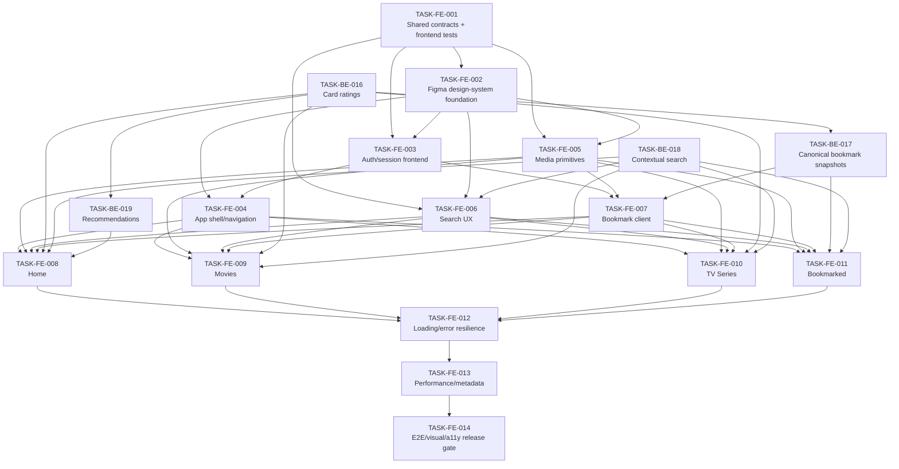

# Frontend Implementation Plan — v1

## 1. Executive Summary

This plan evolves the current partial Nuxt frontend into the Figma-defined Entertainment Web App while preserving the backend architecture completed in `TASK-BE-001` through `TASK-BE-015`.

The frontend is currently a small scaffold rather than a completed application. The repository already contains:

- Nuxt 4 / Vue 3 / TypeScript;
- Tailwind CSS 4 and Nuxt UI;
- a partial `AppHeader`;
- default/auth layouts;
- a partially styled Login page;
- placeholder Home, Movies, TV Series, and Signup pages;
- a complete PostgreSQL/Prisma/TMDB/session/bookmark backend;
- 86 passing backend tests from the completed backend phase;
- CI with PostgreSQL, Prisma generation/migrations, lint, format, typecheck, tests, and build.

The Figma file is the product/design authority. It requires:

- desktop left-sidebar navigation;
- tablet/mobile top navigation;
- Login and Signup;
- Home with Trending and **Recommended for you**;
- contextual search;
- Movies;
- TV Series;
- Bookmarked Movies and TV Series;
- media-card hover/play treatment;
- bookmark states;
- responsive 375 / 768 / 1440 layouts;
- Figma-defined typography, spacing, color, and interaction states.

The investigation also exposed frontend-driven backend refinements that are required before the Figma UI can be implemented faithfully:

1. list/card content-rating enrichment;
2. canonical bookmark snapshot creation with backdrop/rating persistence;
3. contextual movie/TV search and bookmark search/filtering;
4. a real Recommended-for-you endpoint.

Implementation is therefore split into:

- four tightly scoped backend-refinement tasks (`TASK-BE-016` through `TASK-BE-019`);
- fourteen frontend tasks (`TASK-FE-001` through `TASK-FE-014`);
- backlog reconciliation for the existing GitHub issues;
- final cross-browser, accessibility, visual, and E2E release validation.

The goal remains deliberately proportional: **a small application with unusually clean engineering**, not a Netflix-scale architecture.

---

## 2. Planning Authority

### 2.1 Source precedence

When implementation sources conflict, use this order:

| Priority | Source                                  | Authority                                                                  |
| -------- | --------------------------------------- | -------------------------------------------------------------------------- |
| 1        | Figma Designs, Design System, Prototype | Product UI, visible functionality, responsive behavior, component states   |
| 2        | Frontend Technical Specification — v1   | Approved engineering architecture for implementing Figma                   |
| 3        | GitHub `main`                           | Current implementation state                                               |
| 4        | Implemented backend contracts/tests     | Existing API/persistence behavior until intentionally refined by this plan |
| 5        | Frontend Mentor challenge brief         | Supplemental clarification                                                 |
| 6        | Existing GitHub issues/docs             | Historical backlog; must be reconciled when stale                          |

### 2.2 Figma authority

Do not silently simplify a visible Figma requirement because the current code/backend lacks it.

Examples:

- Keep the label **Recommended for you** and implement the required dependencies.
- Use desktop sidebar + tablet/mobile top navigation.
- Preserve media bookmark states and hover/play treatment.
- Preserve contextual search placeholders.
- Preserve Figma card geometry and responsive columns.

### 2.3 Engineering additions allowed

The implementation may add non-destructive behavior not visible in static Figma screens when required for:

- accessibility;
- loading/error/empty states;
- session security;
- browser history;
- SSR correctness;
- testing;
- performance;
- safe logout;
- provider failures.

---

## 3. Current Repository Baseline

Baseline inspected from GitHub `main` on 2026-09-24.

| Area                | Current state                                            | Required direction                                                 |
| ------------------- | -------------------------------------------------------- | ------------------------------------------------------------------ |
| Nuxt                | Nuxt 4.2.x                                               | Keep                                                               |
| Vue                 | Vue 3                                                    | Keep                                                               |
| TypeScript          | Nuxt generated TS projects                               | Keep; strengthen shared app contracts                              |
| UI                  | Nuxt UI + Tailwind CSS 4                                 | Keep where useful; do not force Figma through brittle UI internals |
| State               | Pinia installed, no meaningful store usage               | Remove from frontend v1                                            |
| Fonts               | Google Fonts CSS `@import`                               | Replace with build-managed Outfit loading                          |
| App navigation      | Horizontal `AppHeader`                                   | Replace with Figma desktop sidebar / tablet-mobile top bar         |
| Login               | Partial visual shell                                     | Implement real session flow and exact Figma states                 |
| Signup              | Placeholder                                              | Implement                                                          |
| Home                | Placeholder                                              | Implement Trending + Recommended + Search                          |
| Movies              | Placeholder                                              | Implement provider-backed grid/search                              |
| TV Series           | Placeholder                                              | Implement provider-backed grid/search                              |
| Bookmarked          | Missing                                                  | Implement authenticated grouped page                               |
| Frontend tests      | None                                                     | Add dedicated Nuxt/Vue Vitest project                              |
| Backend tests       | 86 passing                                               | Preserve and extend for refinements                                |
| Public shared types | In `server/utils/contracts.ts`                           | Move/export cross-boundary contracts through `shared/`             |
| Home rendering      | `/` prerendered                                          | Remove static prerender for session-aware dynamic content          |
| Auth sessions       | Opaque HttpOnly DB sessions                              | Preserve; browser never handles token                              |
| Media provider      | TMDB                                                     | Preserve as canonical catalogue                                    |
| Bookmarks           | DB-backed provider references                            | Extend snapshots/contract                                          |
| Search              | TMDB multi-search; people filtered after provider totals | Replace with contextual media-only semantics                       |
| Ratings             | Detail route only                                        | Add list/card enrichment                                           |
| Recommendations     | Missing                                                  | Add                                                                |
| Documentation       | Some stale JWT/Nuxt3/db-push/navigation guidance         | Correct during foundation/release tasks                            |

---

## 4. Figma Reference Map

Use these node IDs as implementation references. Visual tasks should cite the relevant nodes in their GitHub issue body.

### 4.1 Design System

| Purpose                       | Figma node   |
| ----------------------------- | ------------ |
| Design System page            | `2:2`        |
| Search Bar component set      | `2050:2282`  |
| Input Form component set      | `16093:7099` |
| Button component set          | `14080:132`  |
| Navbar component set          | `16093:7164` |
| Bookmark Icon component set   | `16093:7130` |
| Thumbnail hover component set | `16093:7145` |

### 4.2 Home / Search

| Screen                       | Node         |
| ---------------------------- | ------------ |
| Desktop Home                 | `16081:2720` |
| Desktop Home Full            | `16081:1912` |
| Desktop Home Search          | `16081:1361` |
| Desktop Hover/Active         | `16081:1459` |
| Desktop All Trending Content | `16081:13`   |
| Tablet Home                  | `16081:5357` |
| Tablet Home Search           | `16081:4449` |
| Tablet All Trending Content  | `16081:3220` |
| Mobile Home                  | `16081:7536` |
| Mobile Home Full             | `16081:6816` |
| Mobile Home Search           | `16081:6722` |
| Mobile All Trending Content  | `16081:5827` |

### 4.3 Movies

| Screen         | Node          |
| -------------- | ------------- |
| Desktop Movies | `16092:8793`  |
| Tablet Movies  | `16081:4060`  |
| Mobile Movies  | `16092:11278` |

### 4.4 TV Series

| Screen            | Node         |
| ----------------- | ------------ |
| Desktop TV Series | `16093:2`    |
| Tablet TV Series  | `16093:940`  |
| Mobile TV Series  | `16093:1812` |

### 4.5 Bookmarked

| Screen             | Node         |
| ------------------ | ------------ |
| Desktop Bookmarked | `16093:2665` |
| Tablet Bookmarked  | `16093:4470` |
| Mobile Bookmarked  | `16093:5651` |

### 4.6 Authentication

| Screen                      | Node         |
| --------------------------- | ------------ |
| Desktop Login               | `16081:3200` |
| Desktop Login Active/Error  | `16081:3145` |
| Desktop Signup              | `16081:3176` |
| Desktop Signup Active/Error | `16081:3109` |
| Tablet Login                | `16081:5807` |
| Tablet Signup               | `16081:5783` |
| Mobile Login                | `16081:8283` |
| Mobile Signup               | `16081:8261` |

---

## 5. Software Design Philosophy — John Ousterhout Guidance

This plan adopts the complexity-management principles from John Ousterhout's _A Philosophy of Software Design_ as engineering guardrails. They do not replace Figma or the technical specification; they shape how implementation choices should be made.

### 5.1 Strategic programming over tactical patching

When a small amount of extra design work reduces future complexity, prefer the cleaner design instead of the fastest local patch.

Examples for this project:

- establish the `shared/` contract boundary before duplicating API types across components;
- create one canonical TMDB image utility instead of repeating URL construction;
- solve bookmark snapshot authority at the server boundary instead of compensating in every frontend caller;
- establish one search contract instead of separate ad-hoc page filters.

Do not use this principle as justification for speculative frameworks, generic enterprise layers, or future features outside Figma.

### 5.2 Prefer deep modules

A useful module should hide substantial complexity behind a small, stable interface.

Target examples:

- `useAuth()` hides session bootstrap, login/signup/logout state transitions, and redirect handling;
- `useBookmarks()` hides optimistic synchronization and mutation coordination;
- TMDB provider modules hide upstream DTOs, endpoints, retries, caching, and normalization;
- `MediaCard` hides visual state complexity behind a small typed media/bookmark interface.

Avoid shallow wrappers that merely rename `$fetch`, Vue props, or another function without hiding meaningful complexity.

### 5.3 Information hiding is mandatory

Implementation details must remain behind the layer that owns them.

Examples:

- Vue code must not know Prisma details;
- frontend code must not know TMDB bearer-token handling or provider DTO shapes;
- browser code must not know opaque session-token values;
- media-card consumers should not construct provider image URLs;
- pages should not know how recommendation seeds are selected;
- bookmark callers should submit provider identity, not manage persistence snapshots.

If multiple modules must know the same implementation detail, treat that as possible information leakage and reconsider the boundary.

### 5.4 Different layer, different abstraction

Adjacent layers should not be pass-through copies of each other.

Examples:

- page components express page orchestration, not provider request mechanics;
- composables express domain behavior, not thin aliases for raw `$fetch`;
- server services express application operations, not copies of route-handler parameter plumbing;
- provider modules express TMDB operations, not application/session concerns.

Avoid adding a class/service/repository/composable purely to create another layer.

### 5.5 Push complexity downward when it simplifies callers

Prefer one deeper implementation to repeated caller-side rules.

Examples:

- content-rating lookup/caching belongs server-side instead of every card requesting ratings;
- canonical bookmark snapshots belong server-side instead of trusting every browser caller;
- search merging/totals belong in the backend search contract instead of every page repairing provider metadata;
- auth cookie forwarding belongs in shared fetching conventions instead of page-by-page fixes.

### 5.6 Define errors out of existence where practical

Prefer interfaces that make invalid states or repetitive recovery unnecessary.

Examples:

- canonical identity-only bookmark creation removes client snapshot-integrity errors;
- `useAuth()` treats `/me` 401 as the normal anonymous state instead of an application failure;
- media metadata renderers omit missing separators/ratings instead of forcing every caller to special-case them;
- bounded recommendation/rating fan-out prevents avoidable resource-exhaustion failure modes.

Do not suppress genuine operational errors; provider/database failures still need safe explicit handling.

### 5.7 General-purpose only when it reduces total complexity

Modules should be somewhat general where that creates a cleaner interface, but not abstract beyond actual Figma/product needs.

Good:

- reusable `MediaGrid`;
- reusable contextual `SearchBar`;
- shared pagination continuation helper.

Not justified:

- generic CMS renderer;
- provider-agnostic plugin framework;
- universal repository layer;
- generic streaming/player architecture.

### 5.8 Consistency lowers cognitive load

Use one established convention for:

- async reads;
- mutations;
- error mapping;
- shared types;
- identity keys;
- responsive tokens;
- test organization;
- naming.

New code should follow an existing good pattern unless there is a concrete reason to improve the pattern everywhere it applies.

### 5.9 Comments explain design, not syntax

Comments should capture:

- intent;
- invariant;
- trade-off;
- provider/browser quirk;
- reason a non-obvious decision exists.

Do not narrate straightforward code line by line.

### 5.10 Complexity review gate

For every task review, ask:

1. Did this change introduce a new concept/interface/module?
2. Does that concept hide enough complexity to justify its existence?
3. Did implementation knowledge leak into another layer?
4. Is there a pass-through method/component/composable that can be removed?
5. Could a slightly better interface eliminate repeated error handling or special cases?
6. Is the solution broader than the Figma/product scope requires?
7. Will a developer reading this in six months understand the important design decision without reading every implementation detail?

A task may satisfy all acceptance criteria and still require revision if it introduces avoidable complexity.

---

## 7. Core Implementation Principles

### 6.1 Keep backend and frontend responsibilities explicit

```text
Vue/Nuxt app
    ↓
Nitro APIs
    ↓
services/provider/persistence
    ↓
TMDB + PostgreSQL
```

Frontend code must not:

- import Prisma;
- call TMDB with the private token;
- duplicate provider DTOs;
- read the opaque session cookie;
- persist session tokens;
- treat the PostgreSQL database as a full media catalogue.

### 5.2 Data fetching

Use:

```text
route/page/SSR read
→ useFetch / useAsyncData

user mutation
→ $fetch
```

For authenticated SSR reads:

```text
relative useFetch()
or
useAsyncData() + useRequestFetch()
```

Do not use raw SSR `$fetch()` in a way that drops the incoming HttpOnly session cookie.

### 5.3 State

Use:

- Nuxt async-data caches for server state;
- `useState` + small composables for auth/bookmark coordination.

Do not introduce a Pinia store unless a later concrete requirement proves it necessary.

### 5.4 CSS responsiveness

Use CSS/Tailwind breakpoints and layout rules.

Do not use `window.resize` listeners to switch desktop/tablet/mobile navigation.

### 5.5 Provider cache boundary

Provider-owned data may be shared-cacheable.

User-specific state must be added after shared provider data is obtained.

Never shared-cache final personalized recommendation or bookmark responses.

### 5.6 Agent workflow

Coding agents:

- implement one approved task;
- run only focused deterministic tests;
- stop.

Human/CI:

- run full validation;
- inspect diff;
- commit/push/PR;
- merge after required checks.

---

## 7. Phase Overview

### Phase A — Contract and Foundation Enablement

- `TASK-BE-016` Add cache-backed card content-rating enrichment
- `TASK-BE-017` Harden bookmark snapshots and canonical bookmark creation
- `TASK-BE-018` Implement contextual media and bookmark search contracts
- `TASK-BE-019` Implement Recommended-for-you media endpoint
- `TASK-FE-001` Establish shared frontend contracts and test/quality foundation
- `TASK-FE-002` Align Figma design-system foundation

### Phase B — Identity and Application Shell

- `TASK-FE-003` Implement frontend authentication and session flows
- `TASK-FE-004` Implement responsive app shell, navigation, and account menu

### Phase C — Reusable Interaction Layer

- `TASK-FE-005` Implement media presentation and image primitives
- `TASK-FE-006` Implement contextual search and progressive result behavior
- `TASK-FE-007` Implement bookmark client integration

### Phase D — Figma Pages

- `TASK-FE-008` Implement Home
- `TASK-FE-009` Implement Movies
- `TASK-FE-010` Implement TV Series
- `TASK-FE-011` Implement Bookmarked

### Phase E — Release Hardening

- `TASK-FE-012` Complete loading and error resilience
- `TASK-FE-013` Complete frontend performance, metadata, and production hardening
- `TASK-FE-014` Complete E2E, accessibility, visual, and manual regression coverage

---

## 8. Dependency Graph



`TASK-BE-016` through `TASK-BE-019` are frontend-driven backend refinements. They should use the existing **Backend Coding** agent and backend validation workflow.

`TASK-FE-*` tasks should use a focused **Frontend Coding** agent or a general coding agent configured with the same one-task/focused-test discipline.

---

# 9. Detailed Backend Refinement Tasks

## TASK-BE-016 — Add cache-backed media-card content-rating enrichment

**Purpose**

Make list/search/trending/recommendation media responses satisfy the Figma media-card contract without browser-side N+1 requests.

**Existing issue candidate**

- `NEW ISSUE`

**Depends on**

- Existing completed `TASK-BE-007`
- Existing completed `TASK-BE-008`
- Existing completed `TASK-BE-009`
- Existing completed `TASK-BE-010`

**Blocks**

- `TASK-BE-017`
- `TASK-BE-019`
- `TASK-FE-008`
- `TASK-FE-009`
- `TASK-FE-010`

**Current state**

- `MediaItem.contentRating` exists.
- Movie/TV details can resolve regional rating.
- list/search/trending items usually normalize with `contentRating: null`.
- Figma displays rating metadata on media cards.

**Implementation scope**

- Extract/reuse a provider-facing rating resolver usable outside the details route.
- Resolve movie certification from movie release/certification provider data.
- Resolve TV content rating from TV content-rating provider data.
- Respect configured region.
- Add a dedicated in-memory rating cache:
  - successful rating: 24-hour TTL;
  - confirmed no-rating result: 1-hour negative cache;
  - provider failure: do not cache as a successful/no-rating result.
- Limit concurrent rating-provider calls to **5**.
- Enrich cloned normalized provider items; do not mutate shared provider-cache objects in place.
- Apply provider-owned rating enrichment before user-specific bookmark enrichment.
- Add enrichment to:
  - trending;
  - movies;
  - TV;
  - contextual media search when added by BE-018;
  - recommendations when added by BE-019.
- Individual rating failure degrades that item to `contentRating: null`.
- Rating failure must not fail an otherwise successful media list.

**Out of scope**

- Persisting all provider ratings to PostgreSQL.
- Browser-side rating requests.
- Distributed cache.
- User-submitted ratings.
- Media-details UI.

**Affected areas**

Likely:

- `server/providers/tmdb/*`
- `server/services/media.ts`
- rating/cache utility
- unit provider tests
- integration route tests

**Acceptance criteria**

- `AC-1` Movie list items return configured-region rating when provider fixtures contain it.
- `AC-2` TV list items return configured-region rating when provider fixtures contain it.
- `AC-3` Missing rating returns `null`.
- `AC-4` One item’s rating-provider failure does not fail the whole list.
- `AC-5` No more than 5 rating lookups are concurrently in flight.
- `AC-6` Repeated rating lookup within 24h uses cached successful data.
- `AC-7` Confirmed missing rating may be served from the 1h negative cache.
- `AC-8` Provider errors are not cached as successful/missing values.
- `AC-9` Shared provider-cache objects remain user-independent and are not mutated by enrichment.
- `AC-10` Tests make no live TMDB request.

**Focused test expectations**

- rating resolver unit tests;
- TTL/negative-cache tests;
- bounded-concurrency test;
- one representative media-route integration test;
- regression proving partial rating failure degrades instead of failing.

**Human validation**

```bash
npm run lint
npm run format:check
npm run typecheck
npm test
npm run build
```

No schema migration is expected.

**GitHub recommendation**

- Status: `Backlog`
- Priority: `P0`
- Size: `L`
- Estimate: `5`

---

## TASK-BE-017 — Harden bookmark snapshots and canonical bookmark creation

**Purpose**

Make bookmark persistence safe, Figma-card-compatible, and server-authoritative.

**Existing issue candidate**

- `NEW ISSUE`
- Related historical issues: #17, #18

**Depends on**

- `TASK-BE-016`
- Existing completed `TASK-BE-011`
- Existing completed `TASK-BE-012`

**Blocks**

- `TASK-FE-007`
- `TASK-FE-011`

**Current state**

Current bookmark creation accepts a complete client-provided `MediaItem`.

Current `MediaReference` persists:

- provider;
- externalId;
- mediaType;
- title snapshot;
- year snapshot;
- poster snapshot.

It does not persist the Figma-required landscape backdrop or content rating.

A client-provided first snapshot can become shared `MediaReference` data.

**Implementation scope**

- Extend `MediaReference` with:
  - `backdropPathSnapshot String?`
  - `contentRatingSnapshot String?`
- Add committed Prisma migration.
- Change bookmark-create request contract to provider identity:
  - `provider`
  - `externalId`
  - `mediaType`
- Do not trust browser-supplied title/image/rating snapshots.
- Resolve canonical provider media server-side:
  - fetch normalized media details/provider data;
  - resolve rating through the BE-016 rating resolver;
  - derive canonical title/year/poster/backdrop/rating.
- Transactionally upsert/update `MediaReference`.
- Refresh snapshot fields on bookmark creation/re-creation.
- Create bookmark idempotently.
- Return canonical media-card-compatible `MediaItem`.
- Update bookmark listing to expose:
  - backdrop snapshot;
  - content-rating snapshot;
  - existing title/year/poster;
  - `isBookmarked: true`.
- Keep bookmark list database-backed; do not call TMDB per item.
- Preserve shared-reference cleanup behavior and cross-user isolation.

**Out of scope**

- Full provider catalogue persistence.
- Background snapshot refresh job.
- Bookmark folders.
- User history.
- Client-controlled snapshot overrides.

**Data impact**

Prisma migration required.

No destructive migration is expected; new snapshot columns are nullable.

**Acceptance criteria**

- `AC-1` Bookmark create accepts provider identity rather than arbitrary full snapshot data.
- `AC-2` Server resolves canonical provider data before persisting a new/updated reference.
- `AC-3` Malicious client title/image/rating fields cannot create or modify shared snapshot data.
- `AC-4` Backdrop and content-rating snapshots persist when provider data exists.
- `AC-5` Bookmark list renders entirely from PostgreSQL snapshots when TMDB is unavailable.
- `AC-6` Re-bookmarking refreshes stale snapshot fields.
- `AC-7` Bookmark creation remains idempotent under repeated/concurrent requests.
- `AC-8` Two users can share one `MediaReference` without sharing bookmark ownership.
- `AC-9` Deleting one user’s bookmark never removes another user’s bookmark.
- `AC-10` Existing security/redaction guarantees remain intact.

**Focused test expectations**

- migration/schema test;
- bookmark canonical-resolution service test;
- route body validation test;
- client-tampering regression;
- shared-reference/cross-user test;
- offline list-from-snapshot test.

**Human validation**

```bash
npx prisma format
npx prisma validate
npm run db:generate
npm run lint
npm run format:check
npm run typecheck
npm test
npm run build
```

**GitHub recommendation**

- Status: `Backlog`
- Priority: `P0`
- Size: `L`
- Estimate: `5`

---

## TASK-BE-018 — Implement contextual media and bookmark search contracts

**Purpose**

Support the exact Figma search behavior on Home, Movies, TV Series, and Bookmarked pages with truthful result totals.

**Existing issue candidate**

- `NEW ISSUE`
- Related historical issues: #13, #16, #24

**Depends on**

- Existing completed `TASK-BE-007`
- Existing completed `TASK-BE-008`
- Existing completed `TASK-BE-009`
- Existing completed `TASK-BE-012`

**Blocks**

- `TASK-FE-006`
- `TASK-FE-008`
- `TASK-FE-009`
- `TASK-FE-010`
- `TASK-FE-011`

**Current state**

Current `/api/media/search` uses TMDB multi-search, filters people from `data`, but provider pagination metadata may still count people.

Movies/TV page issues still describe client-side filtering of a local catalogue.

Bookmarks do not expose server-side query/type filtering.

**Implementation scope**

### Media search

Target:

```text
GET /api/media/search?q=<query>&type=all|movie|tv&page=<n>
```

- `type` defaults to `all`.
- `movie` uses TMDB movie search.
- `tv` uses TMDB TV search.
- `all` requests the same page from both search streams.
- Merge `all` deterministically:
  - preserve each stream’s internal order;
  - round-robin interleave Movie and TV;
  - dedupe by provider identity.
- `totalResults = movie.totalResults + tv.totalResults`.
- `totalPages = max(movie.totalPages, tv.totalPages)`.
- Treat an unavailable page from one stream as empty when the other stream still has that page.
- People never enter normalized results or totals.
- Cache keys include query/type/page/locale/region.

### Bookmark search

Extend:

```text
GET /api/bookmarks?page=<n>&q=<optional>&mediaType=<optional>
```

- `q` filters title snapshot case-insensitively.
- `mediaType` filters `MOVIE` / `TV`.
- filtering/counting/pagination happen in PostgreSQL.
- preserve ownership boundary.
- totals reflect only filtered user-owned bookmarks.

**Out of scope**

- advanced filters;
- fuzzy/semantic search;
- saved searches;
- full-text database extensions;
- person search.

**Acceptance criteria**

- `AC-1` Home `type=all` result totals count movies + TV only.
- `AC-2` Movie search cannot return TV/person results.
- `AC-3` TV search cannot return movie/person results.
- `AC-4` `all` uses deterministic round-robin merging.
- `AC-5` one provider stream ending earlier does not invalidate later pages from the other.
- `AC-6` media search validation rejects empty/oversized query and invalid type/page.
- `AC-7` bookmark `q`/`mediaType` filtering is ownership-safe and pagination-correct.
- `AC-8` bookmark search does not call TMDB.
- `AC-9` cache entries remain free of user-specific bookmark state.
- `AC-10` no live provider traffic occurs in tests.

**Focused test expectations**

- movie search unit/integration;
- TV search;
- combined merge/totals;
- cache-key regression;
- bookmark q/type filtering;
- cross-user bookmark-search isolation.

**Human validation**

```bash
npm run lint
npm run format:check
npm run typecheck
npm test
npm run build
```

**GitHub recommendation**

- Status: `Backlog`
- Priority: `P0`
- Size: `L`
- Estimate: `5`

---

## TASK-BE-019 — Implement Recommended-for-you media endpoint

**Purpose**

Implement the Figma-required `Recommended for you` section as a real provider-backed feature without introducing a recommendation platform.

**Existing issue candidate**

- `NEW ISSUE`

**Depends on**

- `TASK-BE-016`
- Existing completed bookmark/session/provider services

**Blocks**

- `TASK-FE-008`

**Target API**

```text
GET /api/media/recommended?page=<n>
```

Optional authentication.

**Implementation scope**

### Authenticated user with bookmarks

- Select up to **3** recent distinct bookmarked provider identities as recommendation seeds.
- For Movie seed:
  - use TMDB movie recommendations.
- For TV seed:
  - use TMDB TV recommendations when supported by the provider adapter;
  - use TV similar as fallback if necessary.
- Cache provider seed result independently by:
  - provider identity;
  - page;
  - language;
  - region;
  - endpoint kind.
- Do not cache final user-specific response.
- Merge seed streams deterministically with round-robin interleaving.
- Remove seed items.
- Dedupe by provider identity.
- Normalize to `MediaItem`.
- Apply BE-016 content ratings.
- Apply existing user bookmark enrichment after provider data is assembled.

### Anonymous / no-bookmark fallback

- Reuse provider-backed movie + TV discovery.
- Interleave and dedupe.
- Return useful mixed media instead of an empty response.
- Keep Figma copy `Recommended for you`.

### Pagination

- page 1 is sufficient for initial Home render;
- later pages support progressive recommendation-grid continuation.

**Out of scope**

- ML recommendation model;
- watch-history personalization;
- persistent behavioral profile;
- sensitive inference;
- background recommendation jobs;
- collaborative filtering.

**Acceptance criteria**

- `AC-1` authenticated user with bookmarks receives results derived from bounded bookmark seeds.
- `AC-2` seed items do not reappear as recommendations.
- `AC-3` duplicates across seeds are removed.
- `AC-4` anonymous/no-bookmark request returns mixed discovery fallback.
- `AC-5` provider seed results are shared-cacheable, but the final user-specific response is not shared-cached.
- `AC-6` two users cannot receive each other’s `isBookmarked` state from cache.
- `AC-7` content ratings are enriched through BE-016.
- `AC-8` provider fan-out is bounded to the configured seed count.
- `AC-9` provider failure maps through existing safe error behavior.
- `AC-10` tests use mocked provider traffic only.

**Focused test expectations**

- bookmark-seed selection;
- movie/TV seed provider calls;
- merge/dedupe/remove-seed behavior;
- anonymous fallback;
- cross-user/cache-isolation regression;
- pagination/provider-failure tests.

**Human validation**

```bash
npm run lint
npm run format:check
npm run typecheck
npm test
npm run build
```

**GitHub recommendation**

- Status: `Backlog`
- Priority: `P0`
- Size: `L`
- Estimate: `5`

---

# 10. Detailed Frontend Tasks

## TASK-FE-001 — Establish shared frontend contracts and test/quality foundation

**Purpose**

Create a stable Nuxt frontend engineering boundary before feature implementation expands.

**Existing issue candidate**

- Refine `#34 — Code Quality & Linting`

**Depends on**

- none

**Blocks**

- all frontend tasks

**Implementation scope**

### Shared contracts

Move/export cross-boundary app contracts through `shared/`.

At minimum:

- media type;
- `MediaItem`;
- pagination metadata;
- provider identity;
- safe user type;
- public API error shape;
- auth input schemas where appropriate.

Server-only DTOs/errors/provider/internal types remain under `server/`.

Update server imports and tests without changing public behavior.

### Frontend test project

Extend Vitest multi-project configuration with a dedicated Nuxt frontend project.

Add:

- `@nuxt/test-utils`;
- Vue Test Utils if required;
- `happy-dom` or supported equivalent;
- frontend test setup/helpers;
- one real Nuxt/component smoke test.

Add a convenient focused script, e.g.:

```text
test:frontend
```

`npm test` must still execute all configured non-E2E test projects.

### Dependency hygiene

After verifying actual use, remove obsolete:

- `pinia`;
- `@pinia/nuxt`;
- `jsonwebtoken`;
- `@types/jsonwebtoken`;
- `cookie-es`.

Do not remove Nuxt/UI/icon/runtime dependencies merely because direct imports are absent if modules require them.

### Configuration/document cleanup

- remove Pinia module from Nuxt config;
- remove stale `Nuxt 3` comments;
- remove obsolete JWT assumptions in `SECURITY.md`;
- correct contributor guidance that instructs `prisma db push`/seed/local-catalog workflows;
- correct stale Prisma header guidance;
- remove syntax-narration comments encountered in touched foundation files;
- keep README high-level; do not duplicate the whole technical specification.

**Out of scope**

- Figma visual implementation;
- auth UI;
- media cards;
- page features;
- backend business changes.

**Acceptance criteria**

- `AC-1` app code can import public domain/API types from `shared/` without importing `server/`.
- `AC-2` backend routes/services continue to compile and tests remain green after contract relocation.
- `AC-3` a dedicated Nuxt/Vue test project runs at least one real frontend smoke test.
- `AC-4` `npm test` executes backend + frontend non-E2E projects.
- `AC-5` Pinia is removed from v1 dependencies/configuration.
- `AC-6` obsolete JWT/cookie packages are removed when confirmed unused.
- `AC-7` no current documentation tells contributors to implement JWT/local media/db-push architecture.
- `AC-8` lint/format/typecheck/build pass.

**Focused test expectations**

- shared schema/type import smoke;
- Nuxt mount smoke;
- existing backend targeted contract tests.

**Human validation**

```bash
npm run lint
npm run format:check
npm run typecheck
npm test
npm run build
```

**GitHub recommendation**

- Status: `Backlog`
- Priority: `P0`
- Size: `L`
- Estimate: `5`

---

## TASK-FE-002 — Align the Figma design-system foundation

**Purpose**

Make the CSS/theme/font/accessibility foundation accurately represent the actual Figma Design System before feature components are built.

**Existing issue candidate**

- `NEW ISSUE`
- Related legacy config/design work in closed foundation issues

**Depends on**

- `TASK-FE-001`

**Blocks**

- `TASK-FE-003` through `TASK-FE-014`

**Figma references**

- Design System `2:2`
- Search `2050:2282`
- Input `16093:7099`
- Button `14080:132`
- Navbar `16093:7164`
- Bookmark `16093:7130`
- Thumbnail `16093:7145`

**Implementation scope**

- Replace blocking CSS Google Fonts `@import` with `@nuxt/fonts` or equivalent build-managed/self-hosted Outfit.
- Load only required weights:
  - 300;
  - 400;
  - 500.
- Align color tokens to Figma.
- Add complete spacing scale 0, 100–1000 including missing 600/800.
- Normalize token names; avoid duplicated `spacing-spacing-*` conventions.
- Add complete Figma text presets with exact:
  - size;
  - line height;
  - letter spacing;
  - weight.
- Add missing Mobile Presets 4 and 5.
- Remove current global auth styling that contradicts Figma:
  - red focus border;
  - permanently red submit button;
  - deep brittle `UAuthForm` selectors.
- Restore visible focus foundation.
- Remove global `focus-visible: ring-0` behavior.
- Preserve dark body background and palette.
- Update `DESIGN-SYSTEM.md` so:
  - responsive navigation matches Figma;
  - typography/spacing are complete;
  - contrast claims are not falsely labelled compliant;
  - Nuxt UI usage is guidance, not a requirement to use a UI primitive when custom semantic markup is better.
- Add no page feature behavior.

**Out of scope**

- Navigation component;
- auth form behavior;
- media cards;
- search logic;
- page data.

**Acceptance criteria**

- `AC-1` Outfit 300/400/500 loads without CSS `@import`.
- `AC-2` all Figma spacing tokens exist.
- `AC-3` all Figma typography presets including weight exist.
- `AC-4` input focus foundation no longer contradicts Figma active state.
- `AC-5` interactive elements can display visible `:focus-visible`.
- `AC-6` brittle page-specific global `UAuthForm` selectors are removed.
- `AC-7` design-system documentation matches actual Figma responsive navigation.
- `AC-8` no visual token change introduces typecheck/build failures.

**Focused test expectations**

- token/class smoke if practical;
- one frontend render test verifying baseline body/font/theme.

**Manual Figma validation**

Check representative text/token rendering against Design System page.

**GitHub recommendation**

- Status: `Backlog`
- Priority: `P0`
- Size: `M`
- Estimate: `3`

---

## TASK-FE-003 — Implement frontend authentication and session flows

**Purpose**

Turn the current partial Login/Signup UI into complete opaque-session frontend behavior faithful to Figma.

**Existing issue candidate**

- Refine `#10 — Build Authentication Pages`

**Depends on**

- `TASK-FE-001`
- `TASK-FE-002`

**Blocks**

- `TASK-FE-004`
- `TASK-FE-007`
- authenticated page behavior

**Figma references**

- Desktop Login `16081:3200`
- Desktop Login Error `16081:3145`
- Desktop Signup `16081:3176`
- Desktop Signup Error `16081:3109`
- Tablet Login `16081:5807`
- Tablet Signup `16081:5783`
- Mobile Login `16081:8283`
- Mobile Signup `16081:8261`
- Input component `16093:7099`
- Button component `14080:132`

**Implementation scope**

### `useAuth()`

Implement SSR-safe auth state with `useState`.

State:

- current safe user;
- unknown/authenticated/anonymous status.

Behavior:

- bootstrap using `GET /api/auth/me`;
- treat `401` from `/me` as anonymous state, not a fatal application error;
- login;
- signup;
- logout;
- clear/update auth state.

Do not read or store the raw session cookie/token.

### Route behavior

- `/login`
- `/signup`
- authenticated access to auth pages redirects to `/`;
- `/bookmarked` can later use auth middleware;
- support redirect intent:
  - `/login?redirect=/bookmarked`
  - successful login returns safely to an internal path.
- validate redirect target to prevent external/open redirects.

### Login

- email;
- password;
- shared Zod validation;
- pending state;
- duplicate-submit protection;
- safe invalid-credential messaging;
- successful redirect.

### Signup

- email;
- password;
- repeat password;
- matching validation;
- duplicate-email handling;
- successful authenticated redirect.

### Visual requirements

Reproduce Figma:

- default/filled/active/error input states;
- white active underline;
- red caret;
- red error message/border;
- default white button with Blue 900 text;
- red hover/active button;
- responsive auth card/logo spacing.

Use semantic labels even where the Figma visual relies on placeholder text.

**Out of scope**

- profile settings;
- password reset;
- OAuth;
- rate-limit implementation;
- avatar account menu (FE-004).

**Acceptance criteria**

- `AC-1` initial auth state is SSR-safe and resolves correctly.
- `AC-2` frontend never accesses/persists session token.
- `AC-3` valid login creates authenticated state and redirects.
- `AC-4` invalid login shows safe UI error without leaking backend internals.
- `AC-5` signup validates repeat password and handles conflict.
- `AC-6` auth pages redirect authenticated users.
- `AC-7` redirect query accepts only safe internal paths.
- `AC-8` Figma active/error/button states match at 375/768/1440.
- `AC-9` forms remain fully keyboard accessible.
- `AC-10` focused frontend tests cover bootstrap, forms, errors, redirects.

**GitHub recommendation**

- Status: `Backlog`
- Priority: `P0`
- Size: `L`
- Estimate: `5`

---

## TASK-FE-004 — Implement responsive app shell, navigation, and account menu

**Purpose**

Replace the current horizontal-everywhere header with the exact Figma shell and accessible navigation model.

**Existing issue candidate**

- Refine `#14 — Build Navigation Component`
- Absorb and close `#20 — Create Default Layout`

**Depends on**

- `TASK-FE-002`
- `TASK-FE-003`

**Blocks**

- page tasks

**Figma references**

- Desktop Home `16081:2720`
- Tablet Home `16081:5357`
- Mobile Home `16081:7536`
- Navbar component `16093:7164`

**Implementation scope**

- Replace/rename current `AppHeader` as appropriate.
- Desktop:
  - left vertical sidebar;
  - Figma dimensions/offset/radius;
  - logo top;
  - nav icons;
  - avatar bottom.
- Tablet:
  - Figma horizontal top shell.
- Mobile:
  - Figma full-width 56px top shell.
- Use CSS breakpoints; no JS resize listener.
- Nav items:
  - Home;
  - Movies;
  - TV Series;
  - Bookmarked.
- Exact active icon treatment.
- Icon-only controls have accessible names/tooltips where useful.
- Logo navigates to `/`.
- Bookmarked:
  - unauthenticated navigation redirects to login with return path.
- Avatar:
  - use/export the Figma-provided avatar asset;
  - trigger minimal accessible account menu;
  - menu contains `Log out` only;
  - Escape/outside interaction closes menu;
  - logout calls `useAuth().logout()` and redirects to login.
- Default layout:
  - semantic `<main id="main-content">`;
  - responsive content offsets;
  - skip-to-main link;
  - `NuxtRouteAnnouncer`;
  - remove generic footer if it is not in Figma.
- Remove current Home prerender rule.

**Out of scope**

- profile/settings page;
- bottom mobile nav;
- media page content.

**Acceptance criteria**

- `AC-1` desktop uses left sidebar.
- `AC-2` tablet/mobile use top navigation.
- `AC-3` no viewport resize JS is required.
- `AC-4` active route treatment matches Figma.
- `AC-5` logo navigates home.
- `AC-6` all icon controls have accessible names.
- `AC-7` Bookmarked auth redirect preserves safe return path.
- `AC-8` account menu is keyboard accessible and logs out correctly.
- `AC-9` route announcer/skip-main behavior works.
- `AC-10` default layout contains no non-Figma generic footer.
- `AC-11` `/` is no longer statically prerendered by default.

**GitHub recommendation**

- Status: `Backlog`
- Priority: `P0`
- Size: `L`
- Estimate: `5`

---

## TASK-FE-005 — Implement media presentation and image primitives

**Purpose**

Create reusable, Figma-faithful media components before page composition.

**Existing issue candidate**

- Refine `#12 — Build MediaCard Component`
- Absorb/close `#38 — Image Optimization`

**Depends on**

- `TASK-FE-001`
- `TASK-FE-002`

**Blocks**

- `TASK-FE-007`
- all media pages

**Figma references**

- Bookmark component `16093:7130`
- Thumbnail component `16093:7145`
- Desktop Hover `16081:1459`
- Desktop Home Full `16081:1912`
- Mobile Home Full `16081:6816`

**Implementation scope**

Create the minimum reusable primitives justified by actual usage, conceptually:

- `MediaCard`
- `TrendingCard`
- `MediaMeta`
- `BookmarkButton`
- `PlayOverlay`
- `TrendingRail`
- `MediaGrid`
- media skeleton variant(s)
- `app/utils/tmdb-image.ts`

### TMDB image utility

- pure utility; not a composable;
- build image URL from public provider image base + size + path;
- null-safe;
- responsive `srcset`/sizes where appropriate;
- standard card target around `w300`/`w500`;
- trending target around `w780`;
- avoid layout shift;
- lazy load below fold;
- prioritize the first above-fold image where justified;
- neutral fallback when image missing.

Do not install `@nuxt/image` unless the task proves it adds measurable value for the TMDB remote-image workflow.

### Media card

Desktop image approximately 280×174; tablet 220×140; mobile 164×110.

Display:

- backdrop;
- bookmark;
- year;
- media type icon/label;
- rating when present;
- title.

Missing fields must not leave dangling separators.

### Trending card

- ~470×230 desktop/tablet;
- ~240×140 mobile;
- gradient overlay;
- image-overlay metadata/title.

### Hover/play

- 50% dark overlay;
- play pill;
- play icon/text;
- presentation only;
- no fake button/focus target;
- no playback or details navigation.

### Trending rail

- fixed-width cards;
- horizontal overflow;
- touch/trackpad/wheel;
- content remains keyboard reachable;
- avoid shrinking cards into grid.

**Out of scope**

- page fetching;
- bookmark mutation implementation (FE-007);
- media details page;
- playback.

**Acceptance criteria**

- `AC-1` regular card geometry matches Figma at reference widths.
- `AC-2` Trending uses separate Figma geometry/overlay.
- `AC-3` bookmark default/hover/active visual contract is implemented.
- `AC-4` thumbnail hover/play visual matches Figma and is non-interactive presentation.
- `AC-5` metadata handles null year/rating cleanly.
- `AC-6` image utility is centralized/null-safe/responsive.
- `AC-7` no temporary Figma asset URL is used as production media data.
- `AC-8` media components expose typed props/emits from shared contracts.
- `AC-9` skeleton preserves card geometry.
- `AC-10` focused component tests cover state variants.

**GitHub recommendation**

- Status: `Backlog`
- Priority: `P0`
- Size: `L`
- Estimate: `5`

---

## TASK-FE-006 — Implement contextual search and progressive result behavior

**Purpose**

Create one reusable search interaction that matches Figma and correctly drives the backend’s contextual search contracts.

**Existing issue candidate**

- Refine `#13 — Build SearchBar Component`

**Depends on**

- `TASK-FE-001`
- `TASK-FE-002`
- `TASK-BE-018`

**Blocks**

- page tasks

**Figma references**

- Search component `2050:2282`
- Desktop Search `16081:1361`
- Tablet Search `16081:4449`
- Mobile Search `16081:6722`
- Movies/TV/Bookmarked page nodes for contextual placeholders

**Implementation scope**

### `SearchBar`

- `v-model`;
- contextual placeholder;
- search icon;
- Figma empty/filled/active styling;
- red caret;
- Blue 500 active underline as specified by the reviewed technical spec;
- accessible label;
- no forced submit requirement.

### `useMediaSearch`

- controlled query;
- ~300ms debounce;
- trim whitespace;
- `router.replace` query synchronization;
- no history entry per keystroke;
- restore normal content on empty query;
- safe decoding from route query;
- choose backend search type:
  - Home `all`;
  - Movies `movie`;
  - TV `tv`.
- expose:
  - results;
  - total;
  - status/error;
  - load-next behavior.

### Progressive continuation

Reusable page helper/pattern:

- load page 1 normally;
- `IntersectionObserver` sentinel for next pages;
- no duplicate concurrent next-page load;
- append while preserving existing cards;
- stop at `totalPages`;
- announce appended result status appropriately;
- no visible pagination controls absent from Figma.

Bookmarked uses its own API but may reuse the continuation helper.

**Out of scope**

- advanced filters;
- sorting UI;
- saved searches;
- person search.

**Acceptance criteria**

- `AC-1` contextual placeholders match Figma.
- `AC-2` search starts after ~300ms debounce.
- `AC-3` URL `?q=` reflects active query without history spam.
- `AC-4` blank query restores page normal state.
- `AC-5` Home uses all-media search; Movies/TV use scoped search.
- `AC-6` heading supports `Found N result(s) for ‘q’`.
- `AC-7` next pages append once and stop at total pages.
- `AC-8` back/forward/direct-link query state works.
- `AC-9` component/composable tests use mocked APIs, not TMDB.
- `AC-10` keyboard/focus behavior is accessible.

**GitHub recommendation**

- Status: `Backlog`
- Priority: `P0`
- Size: `M`
- Estimate: `3`

---

## TASK-FE-007 — Implement bookmark client integration

**Purpose**

Connect Figma bookmark controls to the canonical backend without duplicating the media catalogue into client state.

**Existing issue candidate**

- Refine `#18 — Create Pinia Store for Bookmarks`
- Rename away from Pinia/store assumptions.

**Depends on**

- `TASK-FE-003`
- `TASK-FE-005`
- `TASK-BE-017`

**Blocks**

- Home/Movies/TV/Bookmarked page completion

**Implementation scope**

Implement `useBookmarks()` using SSR-safe small state.

Identity key:

```text
<mediaType>:<externalId>
```

Responsibilities:

- seed current known bookmark state from API media responses;
- seed state from bookmark-list responses;
- expose `isBookmarked(identity)`;
- add bookmark through canonical identity-only POST;
- remove bookmark through provider identity DELETE;
- optimistic state change when safe;
- rollback on failed mutation;
- per-identity pending lock preventing duplicate requests;
- handle backend canonical response;
- synchronize multiple cards for the same identity on the current client session.
- unauthenticated bookmark action:
  - no mutation attempt;
  - redirect to Login with current route return intent.

Do not store all fetched media records in the composable.

**Out of scope**

- Pinia;
- localStorage bookmarks;
- offline mutation queue;
- bookmark folders.

**Acceptance criteria**

- `AC-1` bookmark state uses provider media identity, not local DB media IDs.
- `AC-2` add request sends only canonical identity contract.
- `AC-3` optimistic state rolls back on API failure.
- `AC-4` duplicate rapid clicks cannot create concurrent duplicate mutation.
- `AC-5` same identity rendered twice stays synchronized.
- `AC-6` anonymous click redirects to Login safely.
- `AC-7` removing a bookmark updates visible state immediately.
- `AC-8` no raw session token/state is introduced.
- `AC-9` tests cover add/remove/rollback/auth path.

**GitHub recommendation**

- Status: `Backlog`
- Priority: `P0`
- Size: `M`
- Estimate: `3`

---

## TASK-FE-008 — Implement Home page

**Purpose**

Build the primary Figma Home experience against the completed provider-backed APIs.

**Existing issue candidate**

- Refine `#21 — Build Home Page`

**Depends on**

- `TASK-BE-016`
- `TASK-BE-018`
- `TASK-BE-019`
- `TASK-FE-004`
- `TASK-FE-005`
- `TASK-FE-006`
- `TASK-FE-007`

**Figma references**

- Desktop Home `16081:2720`
- Desktop Full `16081:1912`
- Desktop Search `16081:1361`
- Desktop Hover `16081:1459`
- Desktop Trending reference `16081:13`
- Tablet Home `16081:5357`
- Tablet Search `16081:4449`
- Tablet Trending reference `16081:3220`
- Mobile Home `16081:7536`
- Mobile Full `16081:6816`
- Mobile Search `16081:6722`
- Mobile Trending reference `16081:5827`

**Implementation scope**

### Normal Home

Fetch independently:

```text
/api/media/trending
/api/media/recommended
```

- render first **5** Trending cards to match Figma’s intended rail set;
- render recommendations as responsive media grid;
- recommendation grid supports progressive continuation;
- remove/dedupe obvious identity overlap between the currently displayed Trending set and Recommended set on the client if both API datasets contain the same media;
- preserve each section independently if the other fails.

### Search mode

When `?q=` is active:

- replace normal Trending/Recommended content;
- render result heading;
- render combined movie/TV search result grid;
- progressive continuation;
- keep navigation/search visible.

### SSR/auth

- relative `useFetch` so session cookie reaches media routes during SSR;
- initial `isBookmarked` state must not flash from anonymous to authenticated due to dropped SSR cookies.

**Out of scope**

- media details;
- playback;
- custom recommendation controls.

**Acceptance criteria**

- `AC-1` Home matches Figma hierarchy/spacing at 375/768/1440.
- `AC-2` Trending is horizontal and displays 5 primary items.
- `AC-3` Recommended section uses real `/recommended` API.
- `AC-4` authenticated response renders correct bookmark state during SSR/hydration.
- `AC-5` Home search replaces normal sections.
- `AC-6` recommendation continuation appends pages.
- `AC-7` one Home section may remain usable if the other fails.
- `AC-8` duplicate Trending/Recommended identities are not visibly repeated where client already has both datasets.
- `AC-9` focused page tests cover normal/search/error behavior.

**GitHub recommendation**

- Status: `Backlog`
- Priority: `P0`
- Size: `L`
- Estimate: `5`

---

## TASK-FE-009 — Implement Movies page

**Purpose**

Implement Figma Movies with provider-backed scoped search and progressive media results.

**Existing issue candidate**

- Refine `#22 — Build Movies Page`

**Depends on**

- `TASK-BE-016`
- `TASK-BE-018`
- `TASK-FE-004`
- `TASK-FE-005`
- `TASK-FE-006`
- `TASK-FE-007`

**Figma references**

- Desktop `16092:8793`
- Tablet `16081:4060`
- Mobile `16092:11278`

**Implementation scope**

Normal:

- contextual SearchBar `Search for movies`;
- `Movies` heading;
- `GET /api/media/movies`;
- responsive 4/3/2 grid;
- progressive continuation;
- bookmark state/mutation.

Search:

- `GET /api/media/search?type=movie&q=...`;
- accurate result count;
- progressive continuation;
- replace normal content.

SSR/session:

- preserve authenticated bookmark enrichment on server render.

**Acceptance criteria**

- Figma layout matches reference widths.
- only movies appear.
- no client-side filtering of a preloaded catalogue.
- search result count is backend-derived.
- progressive continuation works.
- bookmark state/actions work.
- loading/error states expose hooks used later by FE-012.
- focused page tests pass.

**GitHub recommendation**

- Status: `Backlog`
- Priority: `P0`
- Size: `M`
- Estimate: `3`

---

## TASK-FE-010 — Implement TV Series page

**Purpose**

Implement Figma TV Series using the same shared contracts without duplicating Movies-page logic irresponsibly.

**Existing issue candidate**

- Refine `#23 — Build TV Series Page`

**Depends on**

- same dependency set as FE-009

**Figma references**

- Desktop `16093:2`
- Tablet `16093:940`
- Mobile `16093:1812`

**Implementation scope**

Normal:

- `Search for TV series`;
- `TV Series` heading;
- `GET /api/media/tv`;
- responsive grid;
- progressive continuation;
- bookmark state/mutation.

Search:

- `GET /api/media/search?type=tv&q=...`.

Reuse shared grid/search/card behavior from prior tasks. Do not create a generic page abstraction that obscures the very small page components merely to remove a few lines.

**Acceptance criteria**

- only TV media appears.
- Figma layout matches reference widths.
- search is server-backed and TV-scoped.
- result continuation works.
- bookmark state/actions work.
- focused page tests pass.

**GitHub recommendation**

- Status: `Backlog`
- Priority: `P0`
- Size: `M`
- Estimate: `3`

---

## TASK-FE-011 — Implement Bookmarked page

**Purpose**

Build the authenticated Figma Bookmarked page entirely on user-owned snapshot data.

**Existing issue candidate**

- Refine `#24 — Build Bookmarked Page`

**Depends on**

- `TASK-BE-017`
- `TASK-BE-018`
- `TASK-FE-004`
- `TASK-FE-005`
- `TASK-FE-006`
- `TASK-FE-007`

**Figma references**

- Desktop `16093:2665`
- Tablet `16093:4470`
- Mobile `16093:5651`

**Implementation scope**

- require authentication;
- normal mode makes two independently paginated queries:
  - `mediaType=MOVIE`;
  - `mediaType=TV`;
- render:
  - Bookmarked Movies;
  - Bookmarked TV Series.
- omit an empty section if the other has content;
- show application empty state if both are empty.
- use stored landscape/rating snapshots from BE-017.
- no per-item TMDB requests.

Search:

- use bookmark API `q` + `mediaType`;
- query Movies/TV sections with same search term;
- result count = Movie filtered total + TV filtered total;
- progressive continuation per group where needed;
- removing bookmark updates local view immediately.

Provider outage:

- Bookmarked page remains usable from PostgreSQL snapshots.

**Acceptance criteria**

- authenticated route guard works.
- Movie/TV sections are separated exactly as Figma.
- cards use snapshot backdrop/rating.
- page loads without TMDB availability.
- search filters server-side user bookmarks.
- removal updates immediately and correctly handles section becoming empty.
- full empty state is accessible/Figma-consistent.
- focused integration/component tests pass.

**GitHub recommendation**

- Status: `Backlog`
- Priority: `P0`
- Size: `L`
- Estimate: `5`

---

## TASK-FE-012 — Complete loading and error resilience

**Purpose**

Finish production-quality loading/error/empty behavior across the implemented frontend without introducing a new visual language.

**Existing issue candidate**

- Refine `#36 — Add Loading States`
- Absorb/close `#37 — Error Pages`

**Depends on**

- `TASK-FE-008`
- `TASK-FE-009`
- `TASK-FE-010`
- `TASK-FE-011`

**Implementation scope**

- use media skeletons from FE-005 in page grids/rails;
- avoid full-page spinners for section-level loads;
- auth submit pending behavior;
- search append loading state;
- recommendation/trending partial failure;
- provider-unavailable messages;
- retry where meaningful;
- no-results state;
- no-bookmarks state;
- Nuxt application error handling for real route/runtime failures;
- Figma-consistent 404/500 presentation;
- keep navigation shell usable where appropriate;
- no raw backend/provider error output;
- reduced-motion friendly skeleton/transition behavior.

**Acceptance criteria**

- no major layout jump between skeleton and cards.
- provider failure produces safe retry/error UI.
- Home partial failure does not destroy healthy section.
- 404/500 views are branded and accessible.
- empty search/bookmarks are handled.
- all errors avoid stack/provider/DB details.
- reduced-motion preference is respected.
- focused resilience tests pass.

**GitHub recommendation**

- Status: `Backlog`
- Priority: `P1`
- Size: `M`
- Estimate: `3`

---

## TASK-FE-013 — Complete frontend performance, metadata, and production hardening

**Purpose**

Apply evidence-based performance/metadata polish after the real application exists.

**Existing issue candidate**

- Refine `#30 — Performance Optimization`
- Absorb/close `#39 — SEO & Meta Tags`

**Depends on**

- `TASK-FE-012`

**Implementation scope**

### Performance

- inspect production bundle output;
- remove any remaining confirmed unused dependencies;
- verify no duplicate page/provider fetch during SSR hydration;
- verify image sizes/srcset/lazy behavior;
- ensure above-fold Home image loading does not unnecessarily delay LCP;
- verify no per-card browser fetch;
- verify search debounce;
- verify long pages do not produce obvious excessive rerender/request loops;
- keep Nuxt route-level chunking defaults.

Do not add a bundle-analyzer dependency unless current output cannot answer a concrete question.

### Metadata

- page titles;
- concise descriptions;
- favicon verification;
- minimal Open Graph metadata where useful for public pages;
- no fake dynamic media-detail metadata because v1 has no details route.

### Security/config verification

- no provider token exposed to client bundle/runtime config;
- no auth token storage;
- no stale JWT docs;
- no static Home prerender regression.

### Accessibility spot audit

- contrast;
- focus;
- landmarks;
- heading hierarchy;
- icon labels;
- touch target size.

Lighthouse may be used as diagnostic evidence. A machine-dependent numeric score is a target, not the sole acceptance gate.

**Acceptance criteria**

- production build succeeds.
- no confirmed dead dependency remains from obsolete frontend architecture.
- no duplicate SSR/client initial media request caused by incorrect fetching.
- image loading strategy is appropriate for Figma grids.
- page metadata exists for all v1 routes.
- client bundle contains no TMDB access token/session secret.
- accessibility spot checks find no unresolved critical issue.

**GitHub recommendation**

- Status: `Backlog`
- Priority: `P1`
- Size: `M`
- Estimate: `3`

---

## TASK-FE-014 — Complete frontend E2E, accessibility, visual, and manual regression coverage

**Purpose**

Turn the finished frontend into a release-gated, repeatably verifiable implementation rather than relying on subjective page inspection.

**Existing issue candidate**

- Refine `#29 — Manual Testing Checklist`

**Depends on**

- `TASK-FE-013`

**Blocks**

- frontend v1 completion

**Implementation scope**

### Automated browser smoke

Add Playwright or equivalent browser smoke test.

Use deterministic API mocking at the browser/network boundary; CI must not depend on live TMDB.

Core flow:

```text
login/signup
→ Home
→ browse media
→ bookmark
→ Bookmarked
→ remove bookmark
→ logout
```

Also verify:

- auth redirect;
- search query behavior;
- navigation;
- responsive shell existence.

The browser test does not need to duplicate backend integration tests already covered by Vitest.

### Visual/manual Figma validation

At:

- 375px;
- 768px;
- 1440px;

verify:

- navigation;
- auth;
- Home;
- Search;
- Movies;
- TV;
- Bookmarked;
- card/hover/bookmark states;
- spacing;
- typography;
- images/aspect ratios.

### Accessibility validation

- keyboard-only journey;
- visible focus;
- semantic labels;
- no focus trap;
- account menu Escape behavior;
- bookmark labels;
- form errors;
- search status;
- heading/landmark structure;
- reasonable automated accessibility scan if tooling is added.

### Cross-browser

At minimum:

- Chromium;
- Firefox.

WebKit may be included if CI/runtime cost remains proportionate.

### Final documentation verification

Ensure:

- README/setup remains accurate;
- `SECURITY.md`;
- `CONTRIBUTING.md`;
- `DESIGN-SYSTEM.md`;
- scripts/testing docs;
- no obsolete issue/document examples contradict implementation.

### CI

Integrate frontend tests into required validation.

E2E may be:

- required CI check if stable and deterministic;
- otherwise a documented release/manual gate until stabilized.

**Acceptance criteria**

- `AC-1` deterministic browser smoke passes with no live TMDB dependency.
- `AC-2` complete keyboard flow is possible.
- `AC-3` 375/768/1440 layouts match Figma structure and hierarchy.
- `AC-4` no critical automated accessibility violation remains.
- `AC-5` Chromium and Firefox smoke pass.
- `AC-6` `npm test` includes meaningful frontend tests.
- `AC-7` production build passes.
- `AC-8` complete manual checklist is updated to current architecture.
- `AC-9` no console error occurs in primary user flows.
- `AC-10` documentation reflects final frontend architecture.

**Final validation**

```bash
npx prisma validate
npm run db:generate
npm run lint
npm run format:check
npm run typecheck
npm test
npm run build
npm run ci
# plus configured frontend E2E command
```

**GitHub recommendation**

- Status: `Backlog`
- Priority: `P0` release gate
- Size: `L`
- Estimate: `5`

---

# 11. Backlog Reconciliation

Do **not** apply these mutations until this plan is approved.

| Issue | Current title                                    | Action              | Target                                                                                           |
| ----: | ------------------------------------------------ | ------------------- | ------------------------------------------------------------------------------------------------ |
|    #6 | EPIC 2: Authentication and Session Management    | REFINE              | Mark BE auth complete; keep frontend auth #10 as remaining active child; close epic after FE-003 |
|   #10 | Build Authentication Pages                       | REFINE              | `TASK-FE-003 Implement frontend authentication and session flows`                                |
|   #11 | EPIC 3: Custom Components with Nuxt UI           | REFINE              | Component/app-shell epic for FE-004/005/006; Nuxt UI no longer mandatory for every primitive     |
|   #12 | Build MediaCard Component                        | REFINE              | `TASK-FE-005 Implement media presentation and image primitives`                                  |
|   #13 | Build SearchBar Component                        | REFINE              | `TASK-FE-006 Implement contextual search and progressive result behavior`                        |
|   #14 | Build Navigation Component                       | REFINE              | `TASK-FE-004 Implement responsive app shell, navigation, and account menu`                       |
|   #15 | EPIC 4: Provider-backed Media APIs and Bookmarks | REFINE              | Track BE-016..019 + FE-007; completed BE-007..015 remain historical                              |
|   #18 | Create Pinia Store for Bookmarks                 | REFINE              | `TASK-FE-007 Implement bookmark client integration`; remove Pinia assumption                     |
|   #19 | EPIC 5: Application Pages & Layout               | REFINE              | Track FE-004 + FE-008..011                                                                       |
|   #20 | Create Default Layout                            | CLOSE — SUPERSEDED  | Scope absorbed by FE-004 / #14                                                                   |
|   #21 | Build Home Page                                  | REFINE              | `TASK-FE-008 Implement Home page`                                                                |
|   #22 | Build Movies Page                                | REFINE              | `TASK-FE-009 Implement Movies page`                                                              |
|   #23 | Build TV Series Page                             | REFINE              | `TASK-FE-010 Implement TV Series page`                                                           |
|   #24 | Build Bookmarked Page                            | REFINE              | `TASK-FE-011 Implement Bookmarked page`                                                          |
|   #25 | EPIC 6: Database Seeding & Content               | CLOSE — NOT PLANNED | Obsolete local-catalogue architecture                                                            |
|   #27 | Add Placeholder Images                           | CLOSE — SUPERSEDED  | TMDB supplies media; Figma avatar asset handled by FE-004                                        |
|   #28 | EPIC 7: Testing & Quality Assurance              | REFINE              | Frontend release-quality epic; track #29/#30 and FE-012/014                                      |
|   #29 | Manual Testing Checklist                         | REFINE              | `TASK-FE-014 Complete frontend E2E, accessibility, visual, and manual regression coverage`       |
|   #30 | Performance Optimization                         | REFINE              | `TASK-FE-013 Complete frontend performance, metadata, and production hardening`                  |
|   #31 | EPIC 8: Production Preparation                   | REFINE              | Final frontend quality/release umbrella; #32/#33 backend work already complete                   |
|   #34 | Code Quality & Linting                           | REFINE              | `TASK-FE-001 Establish shared frontend contracts and test/quality foundation`                    |
|   #35 | EPIC 9: Optional Enhancements                    | CLOSE — SUPERSEDED  | Loading/error/image/SEO work is redistributed as required quality, not optional umbrella         |
|   #36 | Add Loading States                               | REFINE              | `TASK-FE-012 Complete loading and error resilience`                                              |
|   #37 | Error Pages                                      | CLOSE — ABSORBED    | Scope absorbed by FE-012 / #36                                                                   |
|   #38 | Image Optimization                               | CLOSE — ABSORBED    | Scope absorbed by FE-005 / #12; Nuxt Image not mandatory                                         |
|   #39 | SEO & Meta Tags                                  | CLOSE — ABSORBED    | Scope absorbed by FE-013 / #30                                                                   |
|   #40 | Add Transitions                                  | CLOSE — NOT PLANNED | No required Figma transition; avoid invented animation                                           |
|   #41 | EPIC 10: Advanced Features (Future)              | KEEP — DEFER        | Future-only umbrella                                                                             |
|   #42 | User Profile Management                          | KEEP — DEFER        | Outside Figma v1                                                                                 |
|   #43 | Advanced Search & Filters                        | KEEP — DEFER        | Basic contextual search is v1; advanced filters remain future                                    |
|   #44 | Media Details Page                               | KEEP — DEFER        | Backend details exists, but no Figma details screen                                              |
|   #45 | Deferred TMDB sync/import and admin tooling      | KEEP — DEFER        | Correct future placeholder                                                                       |
|   #46 | Watch History & Continue Watching                | KEEP — DEFER        | Outside Figma v1                                                                                 |

### New issues required

Create new GitHub issues for:

- `TASK-BE-016`
- `TASK-BE-017`
- `TASK-BE-018`
- `TASK-BE-019`
- `TASK-FE-002`

`TASK-FE-001` and most product tasks can reuse/refine existing issues.

---

# 12. Requirements Traceability

| Technical-spec requirement                | Implemented by                              |
| ----------------------------------------- | ------------------------------------------- |
| Figma is product/design authority         | All FE tasks; backlog reconciliation        |
| Shared app/server contract boundary       | FE-001                                      |
| No Pinia in v1                            | FE-001                                      |
| Nuxt frontend tests                       | FE-001                                      |
| Exact Figma tokens/font/focus foundation  | FE-002                                      |
| Opaque-cookie browser model               | FE-003                                      |
| Login/Signup responsive states            | FE-003                                      |
| Desktop sidebar / tablet-mobile top nav   | FE-004                                      |
| Accessible logout via avatar menu         | FE-004                                      |
| Dynamic SSR Home, no static prerender     | FE-004 / FE-008                             |
| Media-card geometry/state                 | FE-005                                      |
| TMDB image utility                        | FE-005                                      |
| Trending horizontal rail                  | FE-005 / FE-008                             |
| Contextual server search                  | BE-018 / FE-006                             |
| Truthful media-only totals                | BE-018                                      |
| Progressive result continuation           | FE-006 / page tasks                         |
| Canonical server-owned bookmark snapshots | BE-017                                      |
| Backdrop/rating bookmark snapshots        | BE-017                                      |
| Bookmark client synchronization           | FE-007                                      |
| List/card content ratings                 | BE-016                                      |
| Recommended for you                       | BE-019 / FE-008                             |
| Home normal/search states                 | FE-008                                      |
| Movies                                    | FE-009                                      |
| TV Series                                 | FE-010                                      |
| Bookmarked                                | FE-011                                      |
| Loading/empty/error states                | FE-012                                      |
| Performance/metadata hardening            | FE-013                                      |
| WCAG/keyboard/visual/browser release gate | FE-014                                      |
| No live TMDB in CI                        | All backend refinements + FE-014            |
| No media playback/details page v1         | Enforced as non-goal across FE-005/008..011 |
| Auth rate-limit unresolved                | Deferred production security decision       |

---

# 13. Standard Validation Strategy

## 12.1 Agent validation

For each task, the coding agent should run only the focused tests necessary to prove the task’s acceptance criteria.

Do not pay the agent to repeatedly run:

- full `npm test`;
- full lint;
- full format check;
- full typecheck;
- full build;
- Prisma generation/validation unless directly needed by the task.

## 12.2 Human validation — normal frontend task

After agent stops:

```bash
npm run lint
npm run format:check
npm run typecheck
npm test
npm run build
git diff --check
git status
```

## 12.3 Human validation — schema-changing backend refinement

Additionally:

```bash
npx prisma format
npx prisma validate
npm run db:generate
```

and apply migration to disposable PostgreSQL before full tests.

## 12.4 Final release validation

FE-014:

```bash
npx prisma validate
npm run db:generate
npm run lint
npm run format:check
npm run typecheck
npm test
npm run build
npm run ci
<configured E2E command>
```

Plus responsive/Figma/manual accessibility verification.

---

# 14. Task Priority / Size Summary

| Task                                    | Priority | Size | Estimate | Existing carrier |
| --------------------------------------- | -------- | ---- | -------: | ---------------- |
| BE-016 Card content ratings             | P0       | L    |        5 | NEW              |
| BE-017 Canonical bookmark snapshots     | P0       | L    |        5 | NEW              |
| BE-018 Contextual search                | P0       | L    |        5 | NEW              |
| BE-019 Recommendations                  | P0       | L    |        5 | NEW              |
| FE-001 Shared contracts/test foundation | P0       | L    |        5 | #34              |
| FE-002 Figma design-system foundation   | P0       | M    |        3 | NEW              |
| FE-003 Auth/session frontend            | P0       | L    |        5 | #10              |
| FE-004 App shell/navigation             | P0       | L    |        5 | #14              |
| FE-005 Media/image primitives           | P0       | L    |        5 | #12              |
| FE-006 Search UX                        | P0       | M    |        3 | #13              |
| FE-007 Bookmark client                  | P0       | M    |        3 | #18              |
| FE-008 Home                             | P0       | L    |        5 | #21              |
| FE-009 Movies                           | P0       | M    |        3 | #22              |
| FE-010 TV Series                        | P0       | M    |        3 | #23              |
| FE-011 Bookmarked                       | P0       | L    |        5 | #24              |
| FE-012 Loading/error resilience         | P1       | M    |        3 | #36              |
| FE-013 Performance/metadata hardening   | P1       | M    |        3 | #30              |
| FE-014 E2E/visual/a11y release gate     | P0       | L    |        5 | #29              |

Total planning estimate: **76 points**.

The estimate is a relative planning aid, not a calendar-duration promise.

---

# 15. Recommended Execution Order

Because one developer is implementing sequentially, use this order even where the dependency graph permits parallel work:

1. `TASK-FE-001`
2. `TASK-FE-002`
3. `TASK-BE-016`
4. `TASK-BE-017`
5. `TASK-BE-018`
6. `TASK-BE-019`
7. `TASK-FE-003`
8. `TASK-FE-004`
9. `TASK-FE-005`
10. `TASK-FE-006`
11. `TASK-FE-007`
12. `TASK-FE-008`
13. `TASK-FE-009`
14. `TASK-FE-010`
15. `TASK-FE-011`
16. `TASK-FE-012`
17. `TASK-FE-013`
18. `TASK-FE-014`

### Why this order

- Foundation/test/type boundaries come before component growth.
- Figma tokens come before visual components.
- Backend contracts are stabilized before pages depend on them.
- Auth comes before bookmark and account behavior.
- App shell/media/search primitives come before pages.
- Pages come before global resilience/performance QA.
- E2E/visual/a11y is the final release gate.

---

# 16. Risks and Mitigations

| Risk                                                | Impact                         | Mitigation                                                                                      |
| --------------------------------------------------- | ------------------------------ | ----------------------------------------------------------------------------------------------- |
| Content-rating enrichment causes provider fan-out   | Slow lists / provider pressure | concurrency 5, 24h success cache, 1h negative cache, partial degradation                        |
| User-specific cache leakage                         | Privacy bug                    | cache provider seed/data only; user enrichment after cache                                      |
| Bookmark snapshot tampering                         | Shared corrupted metadata      | identity-only create + server canonical lookup                                                  |
| Search totals mismatch visible Figma copy           | Incorrect UX                   | separate movie/TV search and media-only totals                                                  |
| Recommendation scope grows too large                | Overengineering                | max 3 bookmark seeds, provider recommendations only, no ML/profile                              |
| SSR drops auth cookie                               | Bookmark flash/mismatch        | relative `useFetch` / `useRequestFetch`                                                         |
| Figma implementation becomes brittle                | High maintenance               | shared tokens/components, CSS breakpoints, avoid deep Nuxt UI selectors                         |
| Infinite loading duplicates pages                   | Bad UX                         | in-flight guard, append/dedupe, totalPages stop                                                 |
| Dynamic images cause CLS                            | Poor performance               | fixed aspect ratios/dimensions and correct loading priority                                     |
| Frontend tests destabilize backend suite            | Slow/flaky CI                  | separate Vitest `nuxt` project; preserve backend projects                                       |
| Play hover implies real playback                    | Misleading UI                  | presentation only, no focus/button semantics                                                    |
| Old GitHub issues reintroduce obsolete architecture | Architecture drift             | execute backlog reconciliation before coding                                                    |
| Figma rate limits interrupt task implementation     | Planning friction              | plan now contains explicit node IDs/screens; coding tasks request only necessary design context |
| Auth abuse remains unresolved                       | Production security gap        | track existing OPEN-QUESTION-004 separately; do not invent policy                               |

---

# 17. Open / Deferred Decisions

## OPEN-QUESTION-004 — Authentication rate limiting

Existing backend production-readiness item.

It does not block frontend implementation.

Before public production release, decide:

- application-level vs hosting/platform enforcement;
- login threshold/window;
- signup threshold/window;
- response behavior;
- trusted-proxy/IP handling;
- test strategy.

Do not fold this decision into an unrelated FE task.

No other blocking frontend architecture question remains in this plan.

---

# 18. Explicit Out-of-Scope Work

Frontend v1 does not include:

- playback/streaming;
- media-details frontend page;
- cast/crew page;
- reviews;
- user ratings;
- profile/settings page;
- avatar upload;
- password reset;
- OAuth;
- advanced filters/sorting;
- watch providers;
- watch history;
- continue watching;
- local full media catalogue;
- scheduled TMDB mirroring;
- admin sync UI;
- multi-language UI;
- native mobile app;
- PWA/offline mode;
- ML/collaborative-filter recommendation system;
- arbitrary animation/page transitions not defined by Figma.

---

# 19. GitHub Project / Backlog Handoff

After this plan is approved:

1. apply backlog reconciliation to existing issues;
2. create BE-016 through BE-019 and FE-002;
3. rewrite refined issue bodies to use this plan as the implementation contract;
4. set all implementation tasks to `Backlog`;
5. apply Priority / Size / Estimate values from §13;
6. ensure dependencies are written explicitly in each issue body;
7. preserve future issues #41–#46 as deferred rather than deleting them;
8. close obsolete/superseded issues only after the replacement/carrier issue is clearly established.

No code should be modified during backlog reconciliation.

---

# 20. Coding-Agent Handoff Template

For routine FE tasks, use the same low-credit structure proven during backend implementation:

```text
Implement TASK-FE-XXX / issue #NN on the current prepared branch.

Read issue #NN completely and use it as the implementation contract.

Implement only TASK-FE-XXX.

Figma source of truth:
- inspect only the Figma nodes listed in the issue
- do not redesign or substitute visible behavior

Reuse:
- approved shared contracts
- existing tested composables/components
- Figma design tokens

Design-quality guardrails:
- prefer deep modules with small interfaces
- hide implementation knowledge at the owning layer
- do not add pass-through wrappers/composables/services
- push repeated complexity downward when it simplifies callers
- comment non-obvious intent/trade-offs, not syntax
- avoid abstractions broader than the approved Figma/product scope

Do not:
- add unrelated abstractions/refactors
- perform Git/GitHub lifecycle operations
- invent functionality outside the issue
- run the full validation suite

Testing:
- add/run only focused deterministic tests needed for the ACs
- mock API/provider boundaries where appropriate
- stop after focused tests pass

Final report:
- implementation summary
- files changed
- focused test result
- AC status
- blockers
- READY FOR MANUAL VALIDATION
```

Backend refinements should continue using the existing Backend Coding agent with the equivalent `TASK-BE-*` prompt pattern.

---

# 21. GitOps / Human Workflow

```text
Choose approved issue
↓
set In progress
↓
create dedicated task branch manually
↓
fresh VS Code chat + correct coding agent
↓
agent implements + focused tests only
↓
STOP AGENT
↓
human runs full task validation
↓
review diff
↓
stage intended files only
↓
commit + push manually
↓
open PR with Closes #NN
↓
set In review
↓
GitHub Actions
↓
human merge
↓
issue auto-closes
↓
Project → Done
```

For tasks that intentionally close multiple legacy issues, include each closing keyword only when the issue is genuinely completed/superseded by the PR. Backlog-cleanup closures that do not correspond to code should be performed during the backlog-reconciliation step with explanatory comments instead.

---

# 22. Definition of Frontend v1 Complete

Frontend v1 is complete only when:

- all Figma-defined v1 screens are implemented;
- desktop/tablet/mobile navigation matches Figma;
- Login/Signup work with opaque sessions;
- Trending works as a horizontal rail;
- Recommended for you is backed by the real recommendation API;
- contextual search works on Home/Movies/TV/Bookmarked;
- result totals are truthful;
- Movies/TV lists progressively continue;
- Bookmarks use canonical provider identity and safe snapshots;
- Bookmarked works without live TMDB availability;
- media cards display provider ratings when available;
- bookmark state remains correct across SSR/hydration/mutations;
- loading/error/empty states are complete;
- keyboard/accessibility requirements pass;
- frontend tests are meaningful;
- final browser smoke is deterministic and does not call live TMDB;
- full CI/build passes;
- primary layouts are verified against Figma at 375/768/1440;
- obsolete backlog/doc assumptions are removed;
- no out-of-scope feature has been silently introduced;
- final code review finds no avoidable shallow/pass-through abstraction, information leakage, or duplicated complexity that should be pushed into an owning module.

At that point the application represents the intended Figma product on top of the completed provider-backed full-stack architecture.
